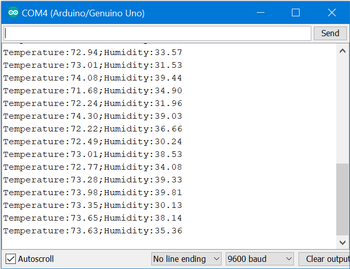
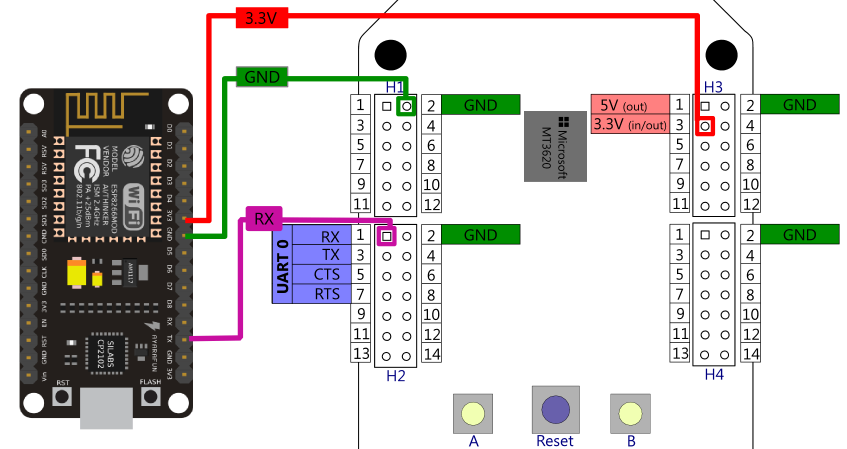
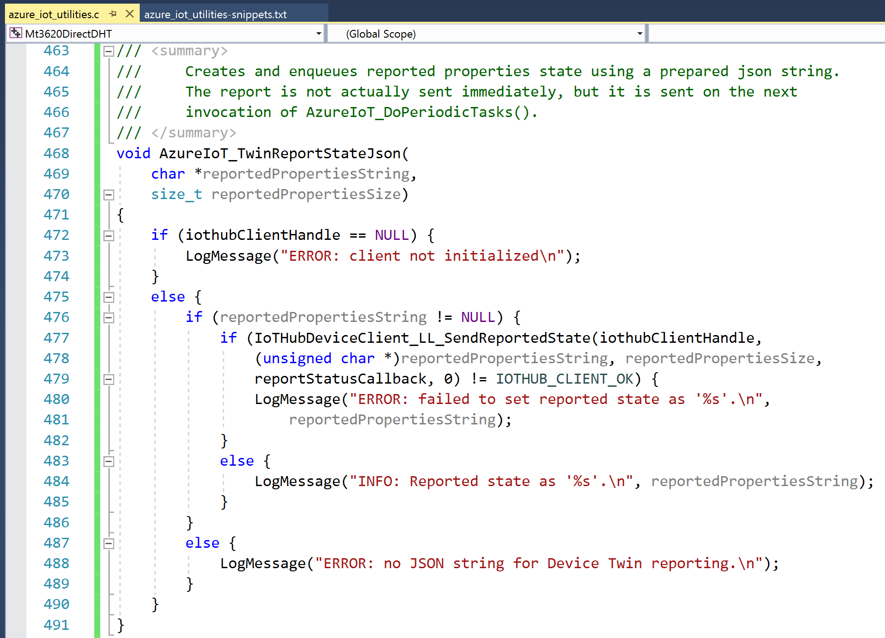
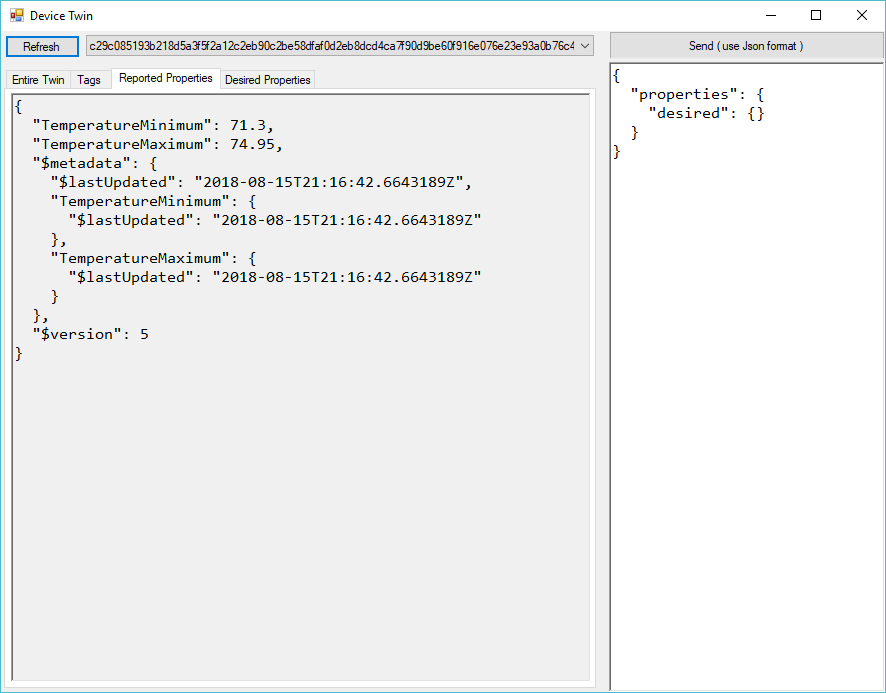
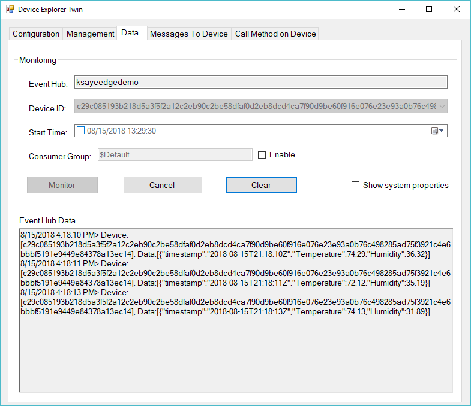

# Lab #2 Auxiliary MCU to Mt3620 to Azure IoT Hub

This lab covers the scenario of a serial (UART) connected auxiliary MCU sending telemetry data to Azure Sphere as connectivity module connecting 
to Azure IoT Hub.

>**Note**, the MT3620 board is a 3.3V board so either use a 3.3V MCU or a [Level Shifter](https://en.wikipedia.org/wiki/Level_shifter) to 
>convert the voltage levels!

For this lab, an existing MCU is provided that already produces the serial data.  For your own lab, the code is as follows
(see also [MCUSerialSketch.ino](./MCUSerialSketch/MCUSerialSketch.ino) ):

```C
float temp, humidity;
String message;

void setup() {
	Serial.begin(9600);
	pinMode(LED_BUILTIN, OUTPUT);
}

void loop() {
	// turn LED on and output randomized temperature and humidity once per second
	digitalWrite(LED_BUILTIN, LOW);
	temp = random(7100, 7500);
	humidity = random(3000, 4000);
	message = "Temperature:";
	message += temp / 100;
	message += ";Humidity:";
	message += humidity / 100;
	Serial.println(message);
	delay(100);
	// turn LED off
	digitalWrite(LED_BUILTIN, HIGH);
	delay(900);
}
```

The output from the other MCU is as follows:


## Wiring the devices (for NodeMCU)
This step assumes you are using the smaller NodeMCU, that runs on 3.3V as well.  If using the Arduino UNO, refer to the next section.

With the Sphere and the other MCU unplugged from power, wire the device as follows:

| Purpose                     | MT3620                  | Aux MCU            |
|-----------------------------|:-----------------------:|:------------------:|
| 3.3V power for NodeMCU      | 3.3V (Header 3, pin 3)  | 3.3V (pin varies)  |
| Common Ground               | GND (Header 1, pin 2)   | Gnd (pin varies)   |
| Transmit from MCU to Sphere | RX (Header 2, pin 1)    | TX (pin varies)    |

Notice that the Transmit on the auxilary MCU is wired to the Receive on Azure Sphere.  
You can use Azure Sphere 3.3V power out and ground to power the auxiliary MCU.


 
For information on the pinout of the board see [GPIO pinout](https://github.com/JuergenSchwertl/AzureSphereSamples#uart-pinout).

## Wiring the devices (for Arduino UNO R3)

This section is for the Arduino Uno R3.  If using the Node MCU, refer to the previous section.

Because the Arduino Uno R3 is a 5.0 Volt board and the Azure Sphere is a 3.3 volt, we will use a Logic Level Shifter to convert voltages.
Wire the UNO to the Level Shifter to the MT3620 as shown below.  The following table explains the wiring:

| UNO          | Wire Color | Level Shifter | Level Shifter | Wire Color | MT3620 |
|--------------|:------:|:---:|:---:|:------:|---------:|
| Pin 0 (RX)   | Green  | B1  | A1  | Yellow | H2 Pin 3 |
| Pin 1 (TX)   | Yellow | B2  | A2  | Green  | H2 Pin 1 |
| GND	       | Black  | GND | GND | Black  | H3 Pin 2 |
| 5-volt power | Red    | HV  | LV  | Red    | H3 Pin 3 |

This picture shows the boards wired up:


## Modifying the code

**Step 1.**	In Visual Studio, open the folder `MCUtoMT3620toAzure`

**Step 2:** Update your *app_manifest.json* settings

Lets manually copy the settings from the Azure Portal. Your *appmanifest.json* should look like 
```json
{
  ...
  "CmdArgs": [ "**your DPS Scope ID**" ],
  "Capabilities": {
    "AllowedConnections": [ "global.azure-devices-provisioning.net", "**your Azure IoT Hub**.azure-devices.net"],
    "DeviceAuthentication": "**your Azure Sphere Tenant id**"
  }  
}
```
Open the [Device Provisioning Services page](https://portal.azure.com/#blade/HubsExtension/BrowseResourceBlade/resourceType/Microsoft.Devices%2FProvisioningServices)
select your Device Provisioning service and copy the *"ID Scope"** (if you hover over the ID Scope value, it shows a copy-icon next to it to copy the name to the clipboard). 
Paste the ID Scope value into the "CmdArgs" list as first parameter replacing the *\*\*your DPS Scope ID\*\** content of the string.

Go to the <a href="https://portal.azure.com/#blade/HubsExtension/BrowseResourceBlade/resourceType/Microsoft.Devices%2FIotHubs" target="_blank">IoT Hubs page</a>, 
select your IoT Hub for this lab and copy the *"Hostname"* from the Overview page (if you hover over the IoT Hub Hostname value, it shows a copy-icon next to it to copy the name to the clipboard).
Paste the IoT Hub Hostname into the *"AllowedConnections"* list replacing the *\*\*your Azure IoT Hub\*\*.azure-devices.net* string content.

Open a Azure Sphere Command window and run the following command to show your Azure Sphere Tenant ID: 
```sh
azsphere tenant show-selected
```
Copy the GUID value and paste it into the *"DeviceAuthentication"* value replacing the *\*\**your Azure Sphere Tenant id\*\** string content.

**Step 3.** Open *azure_iot_utilities.h* on or about line **#41** and add the following code as shown below 
(you can copy these lines also from [*azure_iot_utilities-snippets.txt*](./MCUtoMT3620toAzure/azure_iot_utilities-snippets.txt) from the CMake project folder)
```C
/// <summary>
///     Creates and enqueues reported properties state using a prepared json string.
///     The report is not actually sent immediately, but it is sent on the next 
///     invocation of AzureIoT_DoPeriodicTasks().
/// </summary>
void AzureIoT_TwinReportStateJson(
	char *reportedPropertiesString,
	size_t reportedPropertiesSize);
```


**Step 4.**	Open *azure_iot_utilities.c* and at the end of the file, on or about line **#463** add the following code, as shown below:
```C
/// <summary>
///     Creates and enqueues reported properties state using a prepared json string.
///     The report is not actually sent immediately, but it is sent on the next 
///     invocation of AzureIoT_DoPeriodicTasks().
/// </summary>
void AzureIoT_TwinReportStateJson(
	char *reportedPropertiesString,
	size_t reportedPropertiesSize)
{
	if (iothubClientHandle == NULL) {
		LogMessage("ERROR: client not initialized\n");
	}
	else {
		if (reportedPropertiesString != NULL) {
			if (IoTHubDeviceClient_LL_SendReportedState(iothubClientHandle,
				(unsigned char *)reportedPropertiesString, reportedPropertiesSize,
				reportStatusCallback, 0) != IOTHUB_CLIENT_OK) {
				LogMessage("ERROR: failed to set reported state as '%s'.\n",
					reportedPropertiesString);
			}
			else {
				LogMessage("INFO: Reported state as '%s'.\n", reportedPropertiesString);
			}
		}
		else {
			LogMessage("ERROR: no JSON string for Device Twin reporting.\n");
		}
	}
}
```


**Step 5.**	In Visual Studio, click “Remote GDB Debugger” to compile, deploy, run and debug the code on the device.

**Step 6.**	Monitoring the output window in Visual Studio, you should see the device send the temperature every second as shown below.  
Note how we send telemetry for the Temperature and Humidity while updating the Device Twin when the maximum and minimum temperature changes.


**Step 7.**	Using Azure Device Explorer, viewing the Device Twin properties you should see the min and max temperature received.
>You can get Device Explorer from the [Azure IoT Hub C# SDK](https://github.com/Azure/azure-iot-sdk-csharp/tree/master/tools/DeviceExplorer).
>A pre-built version of the Device Explorer application for Windows can be downloaded from https://aka.ms/aziotdevexp as well as 
>the [Releases](https://github.com/Azure/azure-iot-sdk-csharp/releases) page. (Scroll down for __SetupDeviceExplorer.msi__). 
>The default installation directory for this application is "C:\Program Files (x86)\Microsoft\DeviceExplorer". 
>You might want to pin the DeviceExplorer.exe application to the taskbar for easier access.



**Step 8.**	Using Azure Device Explorer, monitoring the data, you should see both temperature and humidity sent as a JSON message.



**Step 9.**	Unique to this lab, we enabled the Uart `ISU0` in the [*app_manifest.json*](./MCUtoMT3620toAzure/app_manifest.json) using the
*hardware targeting* feature in the Azure Sphere Toolchain, that allows to use macros for better readability in the app_manifest.json 
instead of the raw GPIO port numbers and UART strings:

```json
    "Gpio": [
      "$MT3620_RDB_NETWORKING_LED_RED",
      "$MT3620_RDB_NETWORKING_LED_GREEN",
      "$MT3620_RDB_NETWORKING_LED_BLUE"
    ],
    "Uart": [ "$MT3620_ISU0_UART" ],

```

## Reviewing the code (*main.c*)
Lines 19 - 20 include UART and MCU utilities that are not part of the Azure Sphere SDK.

[MCUtoMT3620toAzure/main.c Line 19ff](./MCUtoMT3620toAzure/main.c#L169)
 
## Reviewing the code (*UART_utilities.c*)

[`UART_InitializeAndAddToEpoll`](./MCUtoMT3620toAzure/UART_utilities.c#L116) configures the settings for the UART, 
opens the UART file descriptor and registers the epoll event handler.
>Make sure you have added the "ISU0" capability (or "$MT3620_ISU0_UART" respectively) in the *appmanifest.json*.
 
[`handleUartEvent`](./MCUtoMT3620toAzure/UART_utilities.c#L45) reads incoming data from the UART into the ring buffer 
and then searches the buffer for `LINE_DELIMITER` characters. For each received line it calls another event handler
 ([*MCU_utilities.c*`MCU_ParseDataToIotHub`](./MCUtoMT3620toAzure/MCU_utilities.c#L173)).
 
You can add the following line to *UART_utilities.h* to get more verbose output on the fragments that are being read in the event handler. 
```C
#define VERBOSE
```

## Reviewing the code (*MCU_utilities.c*)

[`MCU_ParseDataToIotHub`](./MCUtoMT3620toAzure/MCU_utilities.c#L173) parses the incoming line in the 
format "key:value;key:value" in [`parseMessage`](./MCUtoMT3620toAzure/MCU_utilities.c#L78) and extract the Temperature and
Humidity in [`parseKeyValue`](./MCUtoMT3620toAzure/MCU_utilities.c#L58) and then sends the values to IoT Hub in 
[`checkAndSendTelemetry`](./MCUtoMT3620toAzure/MCU_utilities.c#L97) and potentially updates the Device Twin 
in [`checkAndUpdateDeviceTwin`](./MCUtoMT3620toAzure/MCU_utilities.c#L130).


You may continue reviewing both *UART_utilities.h/UART_utilities.c* and *MCU_utilities.h/ MCU_utilities.c* as time allows.

---
[Go back to root](../README.MD#lab-4-connecting-another-mcu-through-uart)

---

### Disclaimer

#### Sample code - No Warranties
THE SAMPLE CODE SOFTWARE IS PROVIDED "AS IS" AND WITHOUT WARRANTY.TO THE MAXIMUM EXTENT 
PERMITTED BY LAW, MICROSOFT DISCLAIMS ANY AND ALL OTHER WARRANTIES, WHETHER EXPRESS OR 
IMPLIED, INCLUDING, BUT NOT LIMITED TO, ANY IMPLIED WARRANTIES OF MERCHANTABILITY, 
NON - INFRINGEMENT, OR FITNESS FOR A PARTICULAR PURPOSE, WHETHER ARISING BY A COURSE 
OF DEALING, USAGE OR TRADE PRACTICE OR COURSE OF PERFORMANCE.
In no event shall Microsoft, its licensors, the authors or copyright holders be liable 
for any claim, damages or other liability, whether in an action of contract, tort or 
otherwise, arising from, out of or in connection with the software or the use thereof.

This code may contain errors and/or may not operate correctly. Microsoft undertakes no 
duty to correct any errors or update the software. Your use of this code is optional and 
subject to any license provided therewith or referenced therein, if any. Microsoft does 
not provide you with any license or other rights to any Microsoft product or service 
through the code provided to you.
