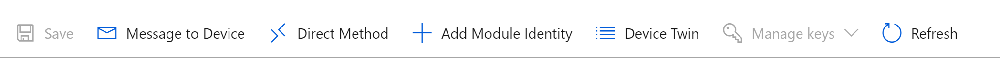
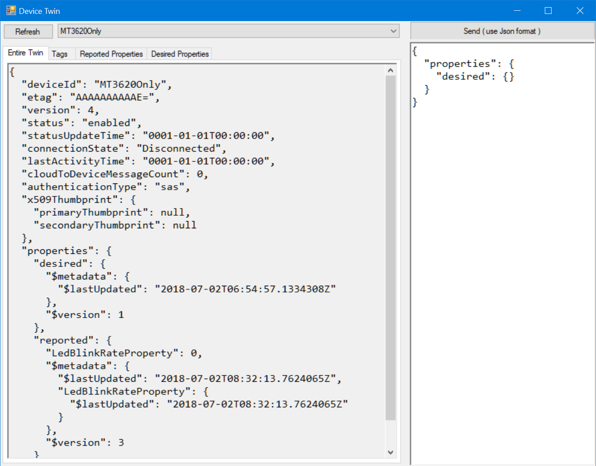
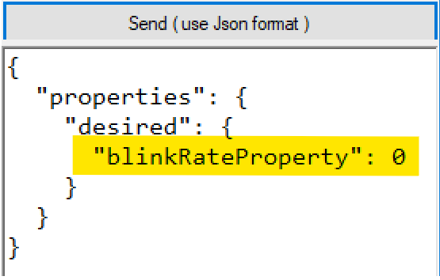
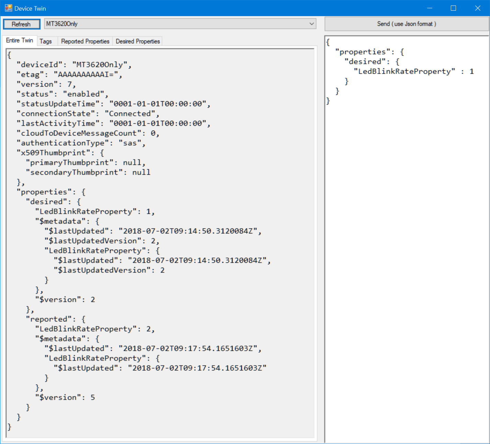
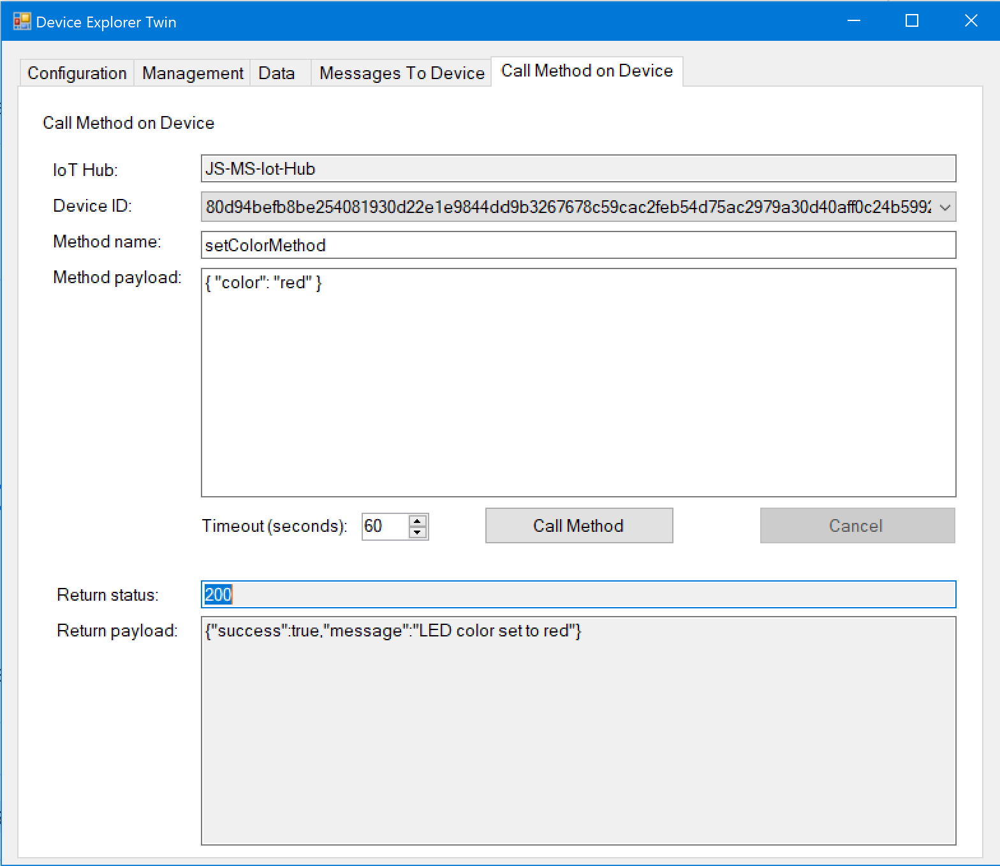
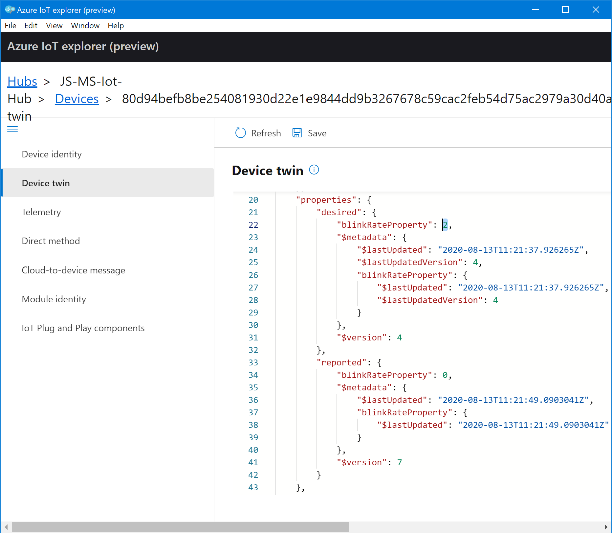

# Lab #1 Azure IoT Hub connected application

Once you've verified that your Azure Sphere board runs your first application and you've setup Azure IoT Hub and the 
Azure IoT Hub Device Provisioning Service, you're ready to go to connect Azure Sphere to Azure IoT Hub:

>**Note:** If you had run through this scenario earlier you will notice that this high-level app sample is now using the CMake toolchain
>and has been extended to support function protoypes also for JSON_Object.
1. In Visual Studio, in the Team Explorer Window open the CmakeLists.txt file in the Mt3620AzureIoTHub directory using **File->Open...->Cmake...**.
2. To prepares your *app_manifest.json* with your Azure IoT Hub settings, a CMake project does not offer the "Connect to Service..." Wizard.
We therefore need to manually copy the settings from the Azure Portal. 
```json
{
  ...
  "CmdArgs": [ "**your DPS Scope ID**" ],
  "Capabilities": {
    "AllowedConnections": [ "global.azure-devices-provisioning.net", "**your Azure IoT Hub**.azure-devices.net"],
    "DeviceAuthentication": "**your Azure Sphere Tenant id**"
  }  
}
```
3. Open the <a href="https://portal.azure.com/#blade/HubsExtension/BrowseResourceBlade/resourceType/Microsoft.Devices%2FProvisioningServices" target="_blank">Device Provisioning Services page</a>,
select your Device Provisioning service and copy the *"ID Scope"** (if you hover over the ID Scope value, it shows a copy-icon next to it to copy the name to the clipboard). 
Paste the ID Scope value into the "CmdArgs" list as first parameter replacing the *\*\*your DPS Scope ID\*\** content of the string.
4. Go to the <a href="https://portal.azure.com/#blade/HubsExtension/BrowseResourceBlade/resourceType/Microsoft.Devices%2FIotHubs" target="_blank">IoT Hubs page</a>, 
select your IoT Hub for this lab and copy the *"Hostname"* from the Overview page (if you hover over the IoT Hub Hostname value, it shows a copy-icon next to it to copy the name to the clipboard).
Paste the IoT Hub Hostname into the *"AllowedConnections"* list replacing the *\*\*your Azure IoT Hub\*\*.azure-devices.net* string content.
5. Open a Azure Sphere Command window and run the following command to show your Azure Sphere Tenant ID:
```azsphere tenant show-selected```<br>
Copy the GUID value and paste it into the *"DeviceAuthentication"* value replacing the *\*\**your Azure Sphere Tenant id\*\** string content.

6. In the Visual Studio debug toolbar click *"Select Startup Item..."* and select *"GDB Debugger (HLCore)"*. 
Press F5 to start the application with debugging.<br>
>The Debug window should show the application starting, authenticating against Device Provisioning Service and then connecting to Azure IoT Hub.

7. Press ButtonA and verify in the log output that Sphere reports a change to the "blinkRateProperty"

Check the main.c comments on interactions with Azure IoT Hub Device Twins, telemetry being sent and available Azure IoT Hub Direct Methods.

If you want to inspect/change the Azure IoT Hub Device Twin, send C2D Messages (cloud-to-device), initiate Direct Methods and 
visualize D2C messages, there are several ways available:

##### Azure Portal and Azure CLI/Cloud Shell
 
To inspect/change Device Twin properties, send Cloud-to-Device messages or initiate Direct Methods: Just open up the device blade in your IoT Hub.
Lookup your IoT Hub on the <a href="https://portal.azure.com/#blade/HubsExtension/BrowseResourceBlade/resourceType/Microsoft.Devices%2FIotHubs" target="_blank">IoT Hubs page</a>.
Open "IoT Devices" under the **Explorers** navigation section of your IoT Hub and select your device id. 

The toolbar below should be pretty self explaining:


Visualizing D2C messages sent from Sphere is bit more complicated, but the Azure CLI comes in handy: Just open up <a href="https://shell.azure.com/" target="_blank">Azure Cloud Shell</a>
 (or run <a href="https://devblogs.microsoft.com/commandline/the-azure-cloud-shell-connector-in-windows-terminal/" target="_blank">Azure Cloud Shell in Windows Terminal</a>).
```sh
az extension add --name azure-iot
az iot hub monitor-events --hub-name **my-iot-hub**
```


##### Device Explorer tool in the Azure IoT C# SDK
>You can get Device Explorer from the [Azure IoT Hub C# SDK](https://github.com/Azure/azure-iot-sdk-csharp/tree/master/tools/DeviceExplorer).
>A pre-built version of the Device Explorer application for Windows can be downloaded from https://aka.ms/aziotdevexp as well as 
>the [Releases](https://github.com/Azure/azure-iot-sdk-csharp/releases) page. (Scroll down for __SetupDeviceExplorer.msi__). 
>The default installation directory for this application is "C:\Program Files (x86)\Microsoft\DeviceExplorer". 
>You might want to pin the DeviceExplorer.exe application to the taskbar for easier access.

For your convenience, this link installs v 1.6.1 right away: [Install Azure IoT SDK Device Explorer](https://github.com/Azure/azure-iot-sdk-csharp/releases/download/2019-9-11/SetupDeviceExplorer.msi) tool.

To configure Device Explorer, copy the "iothubowner" connection string from your [IoT Hub in the Azure Portal](https://ms.portal.azure.com/#blade/HubsExtension/BrowseResourceBlade/resourceType/Microsoft.Devices%2FIotHubs).
You will find the connection string under the "Settings" section with "Shared access policies" after selecting the "iothubowner" policy.
You can copy either the "Connection String-primary key" or "Connection String-secondary key" into the Device Explorer "Configuration"-tab.

If you select your Sphere Device Id under the "Management"-tab and press [Twin Props] you should see the reported properties as follows:


You can now copy the below json into the edit field below the [Send ( use Json format )]-button :
```json
{
  "properties": {
    "desired": {
      "blinkRateProperty": 0
    }
  }
}
```



Press the [Send ( use Json format )]-button to send the desired properties to the device and see the blink frequency change.
You will also see the Device Twin json change accordingly simlar to the following:



Looking at the code, the [*SetLedRate()*](./main.c#L276)-function mirrors the *"desired"* property as *"reported"* property 
but the Json still shows the old value ???
```C
static void SetLedRate(const struct timespec * pBlinkRate)
{
  ...
        // Report the current state to the Device Twin on the IoT Hub.
        AzureIoT_TwinReportStateJson(jsonRoot);
  ...
}
```
Once you hit the [Refresh]-button, you'll see the correct value in "reported" as well.

Now close the "Device Twin" dialog, change to the "Call Method on Device"-tab and select your Azure Sphere Device ID as target.
Enter the method name as "setColorMethod" and as payload
```json
{ "color" : "red" }
```
You should now see something alike



Once you hit the [Call Method]-button, after a second the blinking LED should change the color and 
the "Return status" and "Return payload" should indicate success.

Now look at the [description in *main.c*](./main.c#L29) to see what function the two buttons provide 
and start experimenting with break points in Visual Studio and inspecting the variables.

#### Azure IoT Explorer
A more recent tool is the [Azure IoT Explorer](https://github.com/Azure/azure-iot-explorer)
>**Note**: You can download the .msi from the the [Azure IoT Explorer Release](https://github.com/Azure/azure-iot-explorer/releases) page. 
>As with the Device Explorer, you need to configure the IoT Hub connection string.

Select "Device Twin" from the navigation pane, edit the json and press the [Save] button:



#### Reviewing the code

Let's review some of the utility code: 

Azure Sphere uses a customized version of the [Azure IoT Hub C SDK](https://github.com/Azure/azure-iot-sdk-c) and implements only the 
low-level `IoTHubDeviceClient_LL_` functions of the C SDK and restricts the protocols to MQTT(s).
If you fancy to work on byte or string buffers, you will feel at home with the functions available. Since you will be mostly working with Json data
when sending messages, reporting properties to your device twin or when you to extract parameters from a direct method call, I've added a few functions
that make JSON a bit more digestable in your application parsing the data to and from JSON_Object or JSON_Value objects using [Parson](https://github.com/kgabis/parson), 
a lightweight JSON library for standard C.

Open *azure_iot_utilities.c* on or about line **#550** at function `AzureIoT_SendJsonMessage()`

```C
/// <summary>
///     Creates and enqueues a json message to be delivered the IoT Hub. The message is not actually
///     sent immediately, but it is sent on the next invocation of AzureIoT_DoPeriodicTasks().
/// </summary>
/// <param name="jsonPayload">The json payload of the message to send.</param>
void AzureIoT_SendJsonMessage(JSON_Value* jsonPayload)
{
    char* pszMessagePayload = 0;
    size_t nMessageSize = 0;

    if (setPayloadFromJson(jsonPayload, &pszMessagePayload, &nMessageSize) == IOTHUB_CLIENT_OK) {
        if (pszMessagePayload != NULL) {
            AzureIoT_SendMessageWithContentType(pszMessagePayload, cstrJsonContentType, cstrUtf8Encoding);
            free(pszMessagePayload);
        }
    }
}
```

If you look at the utility function `AzureIoT_SendMessageWithContentType()` you will see that it does set the property bag 
of the message accordingly with the ContentType "application/json" (**UUencoded as "application%2Fjson"!**) and ContentEncoding "utf-8".
Although it is not necessarily required, it is good practice to tell the message processing backend what data format to expect.

```C
   IOTHUB_MESSAGE_HANDLE messageHandle = IoTHubMessage_CreateFromString(messagePayload);
    if (messageHandle == 0) {
        LogMessage("WARNING: unable to create a new IoTHubMessage\n");
        return;
    }

    ...

    (void)IoTHubMessage_SetContentTypeSystemProperty(messageHandle, contentType);
    (void)IoTHubMessage_SetContentEncodingSystemProperty(messageHandle, encoding);

    ...

    if (IoTHubDeviceClient_LL_SendEventAsync(hIoTHubClient, messageHandle, sendMessageCallback,
        /*&callback_param*/ 0) != IOTHUB_CLIENT_OK) {
        LogMessage("WARNING: failed to hand over the message to IoTHubClient\n");
    }

```

---
[Go back to root](../README.MD#lab-2-azure-iot-hub-connected-azure-sphere-application)

---
### Disclaimer

#### Sample code - No Warranties
THE SAMPLE CODE SOFTWARE IS PROVIDED "AS IS" AND WITHOUT WARRANTY.TO THE MAXIMUM EXTENT 
PERMITTED BY LAW, MICROSOFT DISCLAIMS ANY AND ALL OTHER WARRANTIES, WHETHER EXPRESS OR 
IMPLIED, INCLUDING, BUT NOT LIMITED TO, ANY IMPLIED WARRANTIES OF MERCHANTABILITY, 
NON - INFRINGEMENT, OR FITNESS FOR A PARTICULAR PURPOSE, WHETHER ARISING BY A COURSE 
OF DEALING, USAGE OR TRADE PRACTICE OR COURSE OF PERFORMANCE.
In no event shall Microsoft, its licensors, the authors or copyright holders be liable 
for any claim, damages or other liability, whether in an action of contract, tort or 
otherwise, arising from, out of or in connection with the software or the use thereof.

This code may contain errors and/or may not operate correctly. Microsoft undertakes no 
duty to correct any errors or update the software. Your use of this code is optional and 
subject to any license provided therewith or referenced therein, if any. Microsoft does 
not provide you with any license or other rights to any Microsoft product or service 
through the code provided to you.
