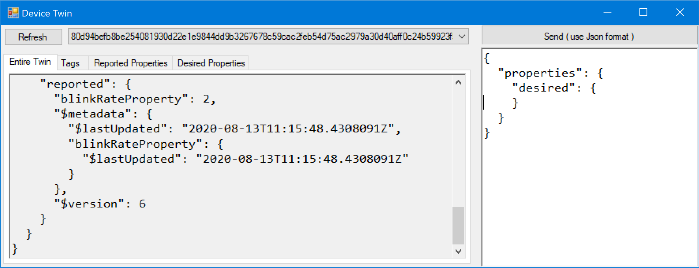
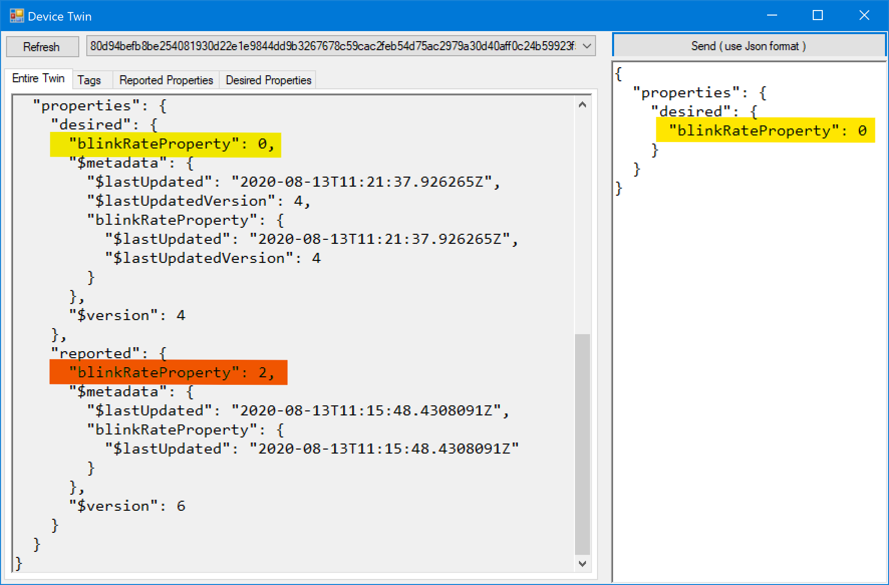

# Lab #1 Azure IoT Hub connected application

Once you've verified that your Azure Sphere board runs your first application and you've setup Azure IoT Hub and the 
Azure IoT Hub Device Provisioning Service, you're ready to go to connect Azure Sphere to Azure IoT Hub:

Step 1.	In Visual Studio, open Mt3620AzureIoTHub\Mt3620AzureIoTHub.sln
Step 2.	In the Solution Explorer, under the Mt3620AzureIoTHub solution, right click on Reference and “Add Connected Service” as shown below:


Select "Device Connectivity with Azure IoT", then your Azure Subscription, Connection Type: "Device Provisioning Service" and your previously created Device provisioning service from the list and press [Add]. 
Make sure that the output shows updates to both `AllowedConnections` and `DeviceAuthentication` properties in the app_manifest.json file.
```
[11.02.2019 18:03:35.153] Adding Device Connectivity with Azure IoT to the project.
[11.02.2019 18:03:35.329] The following hostnames have been added to the AllowedConnections attribute of app_manifest.json: global.azure-devices-provisioning.net, JS-MS-Iot-Hub.azure-devices.net
[11.02.2019 18:03:35.341] The Azure Sphere tenant ID 'c0b88764-9273-46ab-bab2-effecf13f91c' has been added to the DeviceAuthentication attribute of app_manifest.json .
[11.02.2019 18:03:36.441] Azure Sphere Device Provisioning Service scope id:'0ne0002304B'
[11.02.2019 18:03:36.449] Successfully added Device Connectivity with Azure IoT to the project.
```


**Pls. note**
> In the 19.02 version of the Azure Sphere SDK, the Add Connected Service wizard created the required files *azure_iot_tilities.c/.h* and *parson.c/.h* automatically, 
> provisioned the DPS Scope ID and setup the *appmanifest.json*.
> 
> In the 19.05 version, the wizard only applies the required capability settings to the *appmanifest.json* but does **not** create the source files anymore. 
> For your convenience, I've added these files in the project already. However, you need to manually add the DPS Scope ID to *azure_iot_utilities.c* in line #21 : 

```C
//
// String containing the scope id of the Device Provisioning Service
// used to provision the app with the IoT hub hostname and the device id.
//
static const char scopeId[] = "[Enter your DPS scope ID here]";
```

> You can find the DPS Scope ID in the [DPS settings in the Azure Portal](https://portal.azure.com/#blade/HubsExtension/BrowseResourceBlade/resourceType/Microsoft.Devices%2FProvisioningServices).
> The Add Connected Service wizard also provides the Scope ID in the *appmanifest.json* as `"CmdArgs"`-property.


Step 3. Hit F5 to build, deploy the application to your Azure Sphere Device and run the application. 

The Debug window should show the application starting, authenticating against Device Provisioning Service and then connecting to Azure IoT Hub.

Check the main.c comments on interactions with Azure IoT Hub Device Twins, telemetry being sent and available Azure IoT Hub Direct Methods.

Step 4.	Using Azure Device Explorer, viewing the Device Twin properties you should see the `LedBlinkRateProperty` received.
>You can get Device Explorer from the [Azure IoT Hub C# SDK](https://github.com/Azure/azure-iot-sdk-csharp/tree/master/tools/DeviceExplorer).
>A pre-built version of the Device Explorer application for Windows can be downloaded from https://aka.ms/aziotdevexp as well as 
>the [Releases](https://github.com/Azure/azure-iot-sdk-csharp/releases) page. (Scroll down for __SetupDeviceExplorer.msi__). 
>The default installation directory for this application is "C:\Program Files (x86)\Microsoft\DeviceExplorer". 
>You might want to pin the DeviceExplorer.exe application to the taskbar for easier access.

For your convenience, this link installs it right away: [Install Azure IoT SDK Device Explorer](https://github.com/Azure/azure-iot-sdk-csharp/releases/download/2019-1-4/SetupDeviceExplorer.msi) tool.

To configure Device Explorer, copy the "iothubowner" connection string from your [IoT Hub in the Azure Portal](https://ms.portal.azure.com/#blade/HubsExtension/BrowseResourceBlade/resourceType/Microsoft.Devices%2FIotHubs).
You will find the connection string under the "Settings" section with "Shared access policies" after selecting the "iothubowner" policy.
You can copy either the "Connection String-primary key" or "Connection String-secondary key" into the Device Explorer "Configuration"-tab.

If you select your Sphere Device Id under the "Management"-tab and press [Twin Props] you should see the reported properties as follows:


You can now copy the below json into the edit field below the [send (using json format)]-button :
```json
{
  "properties": {
    "desired": {
      "LedBlinkRateProperty": 2
    }
  }
}
```


Press the [send (using json format)]-button to send the desired properties to the device and see the blink frequency change.
You will also see the Device Twin json change accordingly simlar to the following:



Now close the "Device Twin" dialog, change to the "Call Method on Device"-tab and select your Azure Sphere Device ID as target.
Enter the method name as "LedColorControlMethod" and as payload
```json
{ "color" : "red" }
```
You should now see something alike


Once you hit the [Call Method]-button, after a second the blinking LED should change the color and 
the "Return status" and "Return payload" should indicate success.

Now look at the [description in *main.c*](./Mt3620AzureIoTHub/main.c#L29) to see what function the two buttons provide 
and start experimenting with break points in Visual Studio and inspecting the variables.

---
[Back to root](https://github.com/JuergenSchwertl/AzureSphereSamples#lab-3-connecting-a-dht-sensor-and-send-telemetry-to-azure-iot-hub)


