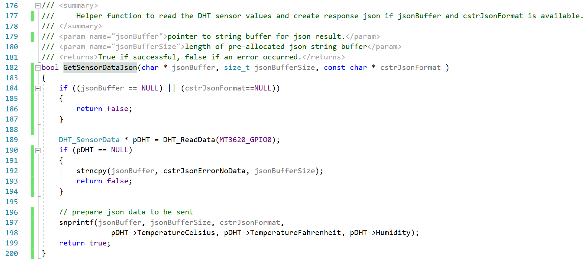
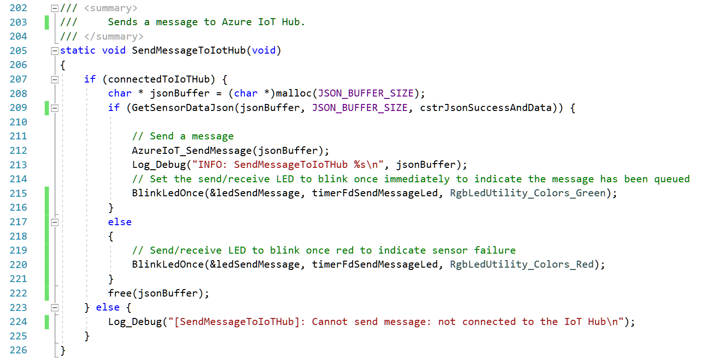
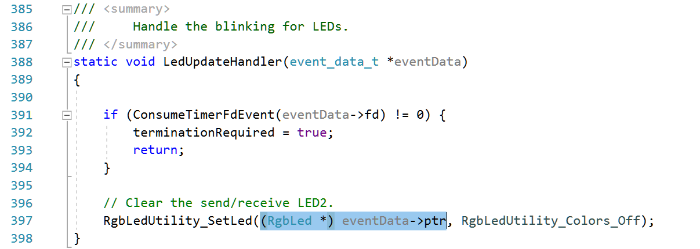

## Lab #3: Connecting a DHT sensor and send telemetry to Azure IoT Hub
For this lab we'll need [this repo](https://github.com/JuergenSchwertl/AzureSphereSamples) cloned.
Please follow the steps as outlined in [Mt3620DirectDHT.pdf](https://github.com/JuergenSchwertl/AzureSphereSamples/blob/master/Mt3620DirectDHT/MT3620DirectDHT.pdf)
to connect the DHT sensor and send telemetry data. It also contains hints to extend the ePoll event_data_t structure to enable event context handling.


### Wiring the device
This lab is the next step. Rather than use the MT3620 to uplift data for a legacy board (aka, the UNO) in this lab we directly connect the sensor to the MT3620.
Hardware Setup.
This lab requires four (4) pieces of hardware:
* MT3620 – Azure Sphere
* Micro USB cable (to program and power the MT3620)
* DHT22 or DHT11 Sensor
* Breadboard or female to female jumper cables

Assemble the hardware by attaching the DHT sensor to the MT3620, using the following wiring diagram:

| Purpose  | MT3620          | DHT11/22 | Pictured wire below |
|----------|-----------------|:--------:|:-------------------:|
|Ground    | Header 1, pin 2 | -        | green               |
|Data      | Header 1, pin 4 | out      | purple              |
|3.3 volts | Header 3, pin 3 | +        | red                 |


For information on the pinout of the board see [GPIO pinout](https://github.com/JuergenSchwertl/AzureSphereSamples#gpios).

### Modifying the code

Step 1.	In Visual Studio, open Mt3620DirectDHT\Mt3620DirectDHT.sln
Step 2.	In the Solution Explorer, under the Mt3620DirectDHT solution, right click on Reference and “Add Connected Service” as shown below:


Select "Device Connectivity with Azure IoT", then your Azure Subscription, Connection Type: "Device Provisioning Service" and your previously created Device provisioning service from the list and press [Add]. 
Make sure that the output shows updates to both `AllowedConnections` and `DeviceAuthentication` properties in the app_manifest.json file.
```
[11.02.2019 18:03:35.153] Adding Device Connectivity with Azure IoT to the project.
[11.02.2019 18:03:35.329] The following hostnames have been added to the AllowedConnections attribute of app_manifest.json: global.azure-devices-provisioning.net, JS-MS-Iot-Hub.azure-devices.net
[11.02.2019 18:03:35.341] The Azure Sphere tenant ID 'c0b88764-9273-46ab-bab2-effecf13f91c' has been added to the DeviceAuthentication attribute of app_manifest.json .
[11.02.2019 18:03:36.441] Azure Sphere Device Provisioning Service scope id:'0ne0002304B'
[11.02.2019 18:03:36.449] Successfully added Device Connectivity with Azure IoT to the project.
```


**Pls. note**
> In the 19.02 version of the Azure Sphere SDK, the Add Connected Service wizard created the required files *azure_iot_tilities.c/.h* and *parson.c/.h* automatically, 
> provisioned the DPS Scope ID and setup the *appmanifest.json*.
> 
> In the 19.05 version, the wizard only applies the required capability settings to the *appmanifest.json* but does **not** create the source files anymore. For your convenience, I've added these files in the project already,
> however, you need to manually add the DPS Scope ID to *azure_iot_utilities.c* in line #21 : 

```C
//
// String containing the scope id of the Device Provisioning Service
// used to provision the app with the IoT hub hostname and the device id.
//
static const char scopeId[] = "[Enter your DPS scope ID here]";
```

> You can find the DPS Scope ID in the [DPS settings in the Azure Portal](https://ms.portal.azure.com/#blade/HubsExtension/BrowseResourceBlade/resourceType/Microsoft.Devices%2FProvisioningServices)

Step 3. Open *azure_iot_utilities.h* on or about line **#41** and add the following code as shown below 
(you can copy these lines also from *azure_iot_utilities-snippets.txt* from the Solution Items folder)
```C
/// <summary>
///     Creates and enqueues reported properties state using a prepared json string.
///     The report is not actually sent immediately, but it is sent on the next 
///     invocation of AzureIoT_DoPeriodicTasks().
/// </summary>
void AzureIoT_TwinReportStateJson(
	char *reportedPropertiesString,
	size_t reportedPropertiesSize);
```


Step 4.	Open *azure_iot_utilities.c* and at the end of the file, on or about line **#463** add the following code, as shown below:
```C
/// <summary>
///     Creates and enqueues reported properties state using a prepared json string.
///     The report is not actually sent immediately, but it is sent on the next 
///     invocation of AzureIoT_DoPeriodicTasks().
/// </summary>
void AzureIoT_TwinReportStateJson(
	char *reportedPropertiesString,
	size_t reportedPropertiesSize)
{
	if (iothubClientHandle == NULL) {
		LogMessage("ERROR: client not initialized\n");
	}
	else {
		if (reportedPropertiesString != NULL) {
			if (IoTHubDeviceClient_LL_SendReportedState(iothubClientHandle,
				(unsigned char *)reportedPropertiesString, reportedPropertiesSize,
				reportStatusCallback, 0) != IOTHUB_CLIENT_OK) {
				LogMessage("ERROR: failed to set reported state as '%s'.\n",
					reportedPropertiesString);
			}
			else {
				LogMessage("INFO: Reported state as '%s'.\n", reportedPropertiesString);
			}
		}
		else {
			LogMessage("ERROR: no JSON string for Device Twin reporting.\n");
		}
	}
}
```


Step 5.	In Visual Studio, click “Remote GDB Debugger” to compile, deploy, run and debug the code on the device.

Step 6.	Monitoring the output window in Visual Studio, you should see the device send the temperature every 15 seconds as shown below:


Step 7.	Pressing the B button should send the temperature instantly.

**Pls. Note**
Using an inexpensive sensor like the DHT11 has limited accuracy and stability.

### Reviewing the code
#### main.c

Line 20 includes the DHT Library (not part of the Azure Sphere SDK).
Line 22ff are now commented out as the Add Connected Service wizard added a definition for `AZURE_IOT_HUB_CONFIGURED` to the project settings
 (RightClick Mt3620DirectDHT-Project->Properties and go to Configuration Properties->C/C++->All Options and check "Additional Options" to 
contain "-D AZURE_IOT_HUB_CONFIGURED".


Lines 176ff reads the sensor data from the hard coded GPIO (GPIO0) and converts to json format.



Lines 202ff  allocate a jsonBuffer and populate the buffer with the DHT sensor data to send the telemetry to Azure IoT Hub.



An interesting change you'll find to the `event_data_t` declaration in *epoll_timerfd_utilities.h* at line #30. 
It has been extended to contain an additional `void * ptr` for additional event context. 


This allows to e.g. use a generic handler for all Led-timers since it now contains the required context information, 
what LED should be affected by the timer. 



#### DHTlib-project and DHTlib.c
The DHTlib project implements a static library to read the sensor data from a DHT 11 or DHT 22 sensor. The DHT 11 uses a 
single wire protocol, where a 18ms low pulse from the Azure Sphere GPIO-port (configured as output) to pull the line to 0 to 
initialize the data transfer.
Then the DHT starts sending data after a 80µs low and 80µs high preamble. Each bit to be transferred is indicated by a 50µs low, followed
by a  26-28 µsec indicating a "0" bit ro a 70 µsec indicating a "1" bit.
To disect that protocol DHTlib.c implements a mechanism called bit-banging, checking the line state in a counter loop looking for 
state transitions. 

This is the typical way how you would implement this in a micro-controller since the code there is mostly deterministic during runtime. With
Azure Sphere, your high level application runs within a Linux process and may be preempted by the operating system at any time. If the OS chooses 
to consume some cycles, the counter loop though may miss one or more state transitions and the sensor reading fails.

If you run this sample application for a while, you'll see that every once in a while the sensor reading may fail reading the data.


---
[Back to root](../README.md)


