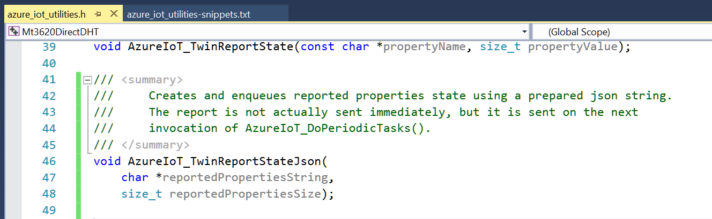
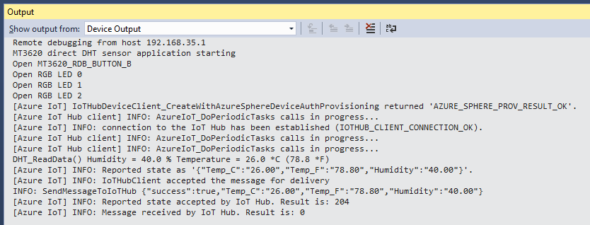
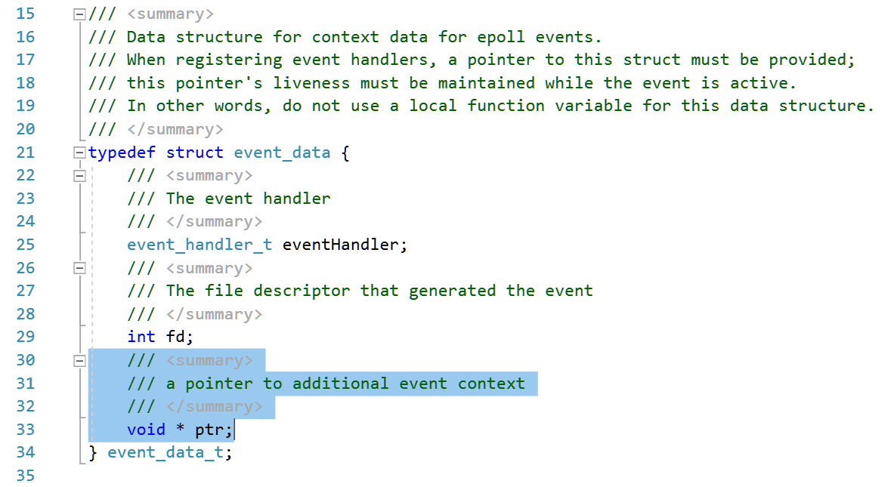

## Lab #3: Connecting a DHT sensor and send telemetry to Azure IoT Hub
For this lab we'll need [this repo](https://github.com/JuergenSchwertl/AzureSphereSamples) cloned. It also contains hints 
to extend the ePoll event_data_t structure to enable event context handling.


### Wiring the device
This lab is the next step. Rather than use the MT3620 to uplift data for a legacy board (aka, the UNO) in this lab we directly connect the sensor to the MT3620.
Hardware Setup.
This lab requires four (4) pieces of hardware:
* MT3620 – Azure Sphere
* Micro USB cable (to program and power the MT3620)
* DHT22 or DHT11 Sensor
* Breadboard or female to female jumper cables

Assemble the hardware by attaching the DHT sensor to the MT3620, using the following wiring diagram:

| Purpose  | MT3620          | DHT11/22 | Pictured wire below |
|----------|-----------------|:--------:|:-------------------:|
|Ground    | Header 1, pin 2 | -        | green               |
|Data      | Header 1, pin 4 | out      | purple              |
|3.3 volts | Header 3, pin 3 | +        | red                 |


For information on the pinout of the board see [GPIO pinout](https://github.com/JuergenSchwertl/AzureSphereSamples#gpios).

### Modifying the code

>**Note:** If you had run through this scenario earlier you will notice that this high-level app sample is now using the CMake toolchain.

Step 1. In Visual Studio, in the Team Explorer Window open the CmakeLists.txt file in the IoTConnectHL directory using **File->Open...->Cmake...**.

Step 2. To prepares your *app_manifest.json* with your Azure IoT Hub settings, a CMake project does not offer the "Connect to Service..." Wizard.
We therefore need to manually copy the settings from the Azure Portal. 
```json
{
  ...
  "CmdArgs": [ "**your DPS Scope ID**" ],
  "Capabilities": {
    "AllowedConnections": [ "global.azure-devices-provisioning.net", "**your Azure IoT Hub**.azure-devices.net"],
    "DeviceAuthentication": "**your Azure Sphere Tenant id**"
  }  
}
```
* Open the <a href="https://portal.azure.com/#blade/HubsExtension/BrowseResourceBlade/resourceType/Microsoft.Devices%2FProvisioningServices" target="_blank">Device Provisioning Services page</a>,
select your Device Provisioning service and copy the *"ID Scope"** (if you hover over the ID Scope value, it shows a copy-icon next to it to copy the name to the clipboard). 
Paste the ID Scope value into the "CmdArgs" list as first parameter replacing the *\*\*your DPS Scope ID\*\** content of the string.
* Go to the <a href="https://portal.azure.com/#blade/HubsExtension/BrowseResourceBlade/resourceType/Microsoft.Devices%2FIotHubs" target="_blank">IoT Hubs page</a>, 
select your IoT Hub for this lab and copy the *"Hostname"* from the Overview page (if you hover over the IoT Hub Hostname value, it shows a copy-icon next to it to copy the name to the clipboard).
Paste the IoT Hub Hostname into the *"AllowedConnections"* list replacing the *\*\*your Azure IoT Hub\*\*.azure-devices.net* string content.
* Open a Azure Sphere Command window and run the following command to show your Azure Sphere Tenant ID:
```sh
azsphere tenant show-selected
```
Copy the GUID value and paste it into the *"DeviceAuthentication"* value replacing the *\*\**your Azure Sphere Tenant id\*\** string content.

Step 3. Open *azure_iot_utilities.h* on or about line **#41** and add the following code as shown below 
(you can copy these lines also from *azure_iot_utilities-snippets.txt* from the Solution Items folder)
```C
/// <summary>
///     Creates and enqueues reported properties state using a prepared json string.
///     The report is not actually sent immediately, but it is sent on the next 
///     invocation of AzureIoT_DoPeriodicTasks().
/// </summary>
void AzureIoT_TwinReportStateJson(
	char *reportedPropertiesString,
	size_t reportedPropertiesSize);
```


Step 4.	Open *azure_iot_utilities.c* and at the end of the file, on or about line **#463** add the following code, as shown below:
```C
/// <summary>
///     Creates and enqueues reported properties state using a prepared json string.
///     The report is not actually sent immediately, but it is sent on the next 
///     invocation of AzureIoT_DoPeriodicTasks().
/// </summary>
void AzureIoT_TwinReportStateJson(
	char *reportedPropertiesString,
	size_t reportedPropertiesSize)
{
	if (iothubClientHandle == NULL) {
		LogMessage("ERROR: client not initialized\n");
	}
	else {
		if (reportedPropertiesString != NULL) {
			if (IoTHubDeviceClient_LL_SendReportedState(iothubClientHandle,
				(unsigned char *)reportedPropertiesString, reportedPropertiesSize,
				reportStatusCallback, 0) != IOTHUB_CLIENT_OK) {
				LogMessage("ERROR: failed to set reported state as '%s'.\n",
					reportedPropertiesString);
			}
			else {
				LogMessage("INFO: Reported state as '%s'.\n", reportedPropertiesString);
			}
		}
		else {
			LogMessage("ERROR: no JSON string for Device Twin reporting.\n");
		}
	}
}
```


In the Visual Studio debug toolbar click *"Select Startup Item..."* and select *"GDB Debugger (HLCore)"*. Press F5 to start the application with debugging.

The Debug window should show the application starting, authenticating against Device Provisioning Service and then connecting to Azure IoT Hub.

Check the main.c comments on interactions with Azure IoT Hub Device Twins, telemetry being sent and available Azure IoT Hub Direct Methods.

Step 6.	Monitoring the output window in Visual Studio, you should see the device send the temperature every 15 seconds as shown below:


Step 7.	Pressing the B button should send the temperature instantly.

**Pls. Note**
Using an inexpensive sensor like the DHT11 has limited accuracy and stability.

### Reviewing the code
#### main.c

Line 20 includes the DHT library header file (not part of the Azure Sphere SDK).

Lines 233ff reads the sensor data from the hard coded GPIO (GPIO0) and converts to json format.

```C
/// <summary>
///     Helper function to read the DHT sensor values and create response json if jsonBuffer and cstrJsonFormat is available.
/// </summary>
/// <param name="jsonBuffer">pointer to string buffer for json result.</param>
/// <param name="jsonBufferSize">length of pre-allocated json string buffer</param>
/// <returns>True if successful, false if an error occurred.</returns>
bool GetSensorDataJson(char * jsonBuffer, size_t jsonBufferSize, const char * cstrJsonFormat )
{
	if ((jsonBuffer == NULL) || (cstrJsonFormat==NULL))
	{ 
		return false;
	}

	DHT_SensorData * pDHT = DHT_ReadData(MT3620_GPIO0);
	if (pDHT == NULL)
	{
		strncpy(jsonBuffer, cstrJsonErrorNoData, jsonBufferSize);
		return false;
	}

	// prepare json data to be sent 
	snprintf(jsonBuffer, jsonBufferSize, cstrJsonFormat,
				pDHT->TemperatureCelsius, pDHT->TemperatureFahrenheit, pDHT->Humidity);
	return true;
}
```
Lines 283ff  allocate a jsonBuffer and populate the buffer with the DHT sensor data to send the telemetry to Azure IoT Hub (or Azure IoT Central repectively).

```C
/// <summary>
///     Sends a message to Azure IoT Central / Azure IoT hub
/// </summary>
static void SendMessage(void)
{
    if (connectedToIoTHub) {
		char * jsonBuffer = (char *)malloc(JSON_BUFFER_SIZE);
		if (GetSensorDataJson(jsonBuffer, JSON_BUFFER_SIZE, cstrJsonSuccessAndData)) {

			// Send a message
			AzureIoT_SendMessage(jsonBuffer);
			Log_Debug("[SendMessageToIoTHub] %s\n", jsonBuffer);
			// Set the send/receive LED to blink once immediately to indicate the message has been queued
			BlinkLedOnce(&ledSendMessage, timerFdSendMessageLed, RgbLedUtility_Colors_Green);
		}
		else
		{
			// Send/receive LED to blink once red to indicate sensor failure
			BlinkLedOnce(&ledSendMessage, timerFdSendMessageLed, RgbLedUtility_Colors_Red);
		}
		free(jsonBuffer);
    } else {
		Log_Debug("[SendMessageToIoTHub] not connected to IoT Central/Hub: no telemetry sent.\n");
    }
}
```

An interesting change you'll find to the `event_data_t` declaration in *epoll_timerfd_utilities.h* at line #30. 
It has been extended to contain an additional `void * ptr` for additional event context. 



main.c, line 503ff: This allows to e.g. use a generic handler for all Led-timers since it now contains the required context information, 
what LED should be affected by the timer. 

```C
/// <summary>
///     Handle the blink once for all LEDs.
/// </summary>
static void LedUpdateHandler(event_data_t *eventData)
{
	
	if (ConsumeTimerFdEvent(eventData->fd) != 0) {
		terminationRequired = true;
		return;
	}

	// Clear the LED.
	RgbLedUtility_SetLed((RgbLed *) eventData->ptr, RgbLedUtility_Colors_Off);
}
```

#### DHTlib-project and DHTlib.c
The DHTlib project implements a static library to read the sensor data from a DHT 11 or DHT 22 sensor. The DHT 11 uses a 
single wire protocol, where a 18ms low pulse from the Azure Sphere GPIO-port (configured as output) to pull the line to 0 to 
initialize the data transfer.
Then the DHT starts sending data after a 80µs low and 80µs high preamble. Each bit to be transferred is indicated by a 50µs low, followed
by a  26-28 µsec indicating a "0" bit or a 70 µsec indicating a "1" bit.
To disect that protocol DHTlib.c implements a mechanism called bit-banging, checking the line state in a counter loop looking for 
state transitions. 

This is the typical way how you would implement this in a micro-controller since the code there is mostly deterministic during runtime. With
Azure Sphere, your high level application runs within a Linux process and may be preempted by the operating system at any time. If the OS chooses 
to consume some cycles, the counter loop though may miss one or more state transitions and the sensor reading fails.

If you run this sample application for a while, you'll see that every once in a while the sensor reading reports an error reading the data.

---
[Back to root](https://github.com/JuergenSchwertl/AzureSphereSamples#lab-3-connecting-a-dht-sensor-and-send-telemetry-to-azure-iot-hub)


