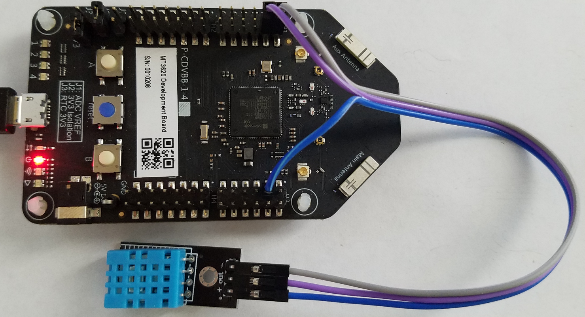
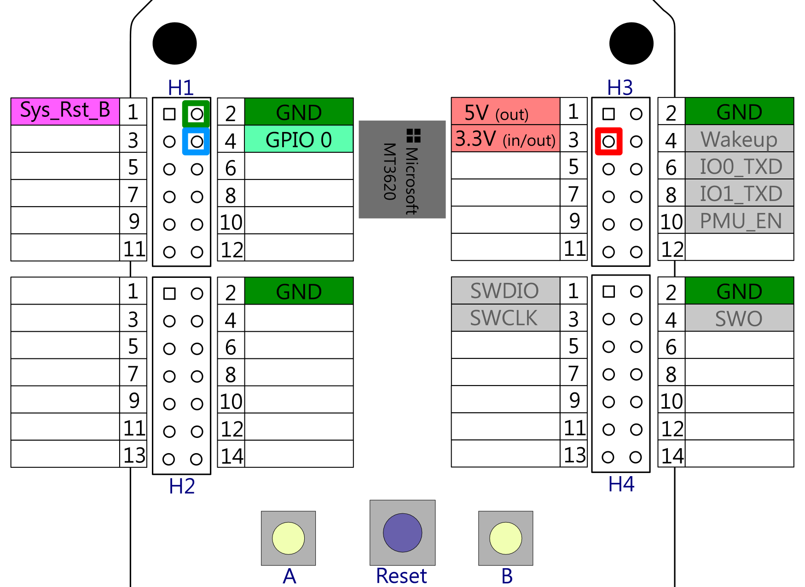

## Lab #3: Connecting a DHT sensor and send telemetry to Azure IoT Hub
For this lab we'll need [this repo](https://github.com/JuergenSchwertl/AzureSphereSamples) cloned.
Please follow the steps as outlined in [Mt3620DirectDHT.pdf](https://github.com/JuergenSchwertl/AzureSphereSamples/blob/master/Mt3620DirectDHT/MT3620DirectDHT.pdf)
to connect the DHT sensor and send telemetry data. It also contains hints to extend the ePoll event_data_t structure to enable event context handling.



### Wiring the device
This lab is the next step. Rather than use the MT3620 to uplift data for a legacy board (aka, the UNO) in this lab we directly connect the sensor to the MT3620.
Hardware Setup.
This lab requires four (4) pieces of hardware:
* MT3620 – Azure Sphere
* Micro USB cable (to program and power the MT3620)
* DHT22 or DHT11 Sensor
* Breadboard or female to female jumper cables

Assemble the hardware by attaching the DHT sensor to the MT3620, using the following wiring diagram:

| Purpose  | MT3620          | DHT11/22 | Pictured wire below |
|----------|-----------------|:--------:|:-------------------:|
|Ground    | Header 1, pin 2 | -        | green               |
|Data      | Header 1, pin 4 | out      | purple              |
|3.3 volts | Header 3, pin 3 | +        | red                 |



For information on the pinout of the board see [GPIO pinout](https://github.com/JuergenSchwertl/AzureSphereSamples#gpios).

### Modifying the code

1.	In Visual Studio, open Mt3620DirectDHT\Mt3620DirectDHT.sln
2.	In the Solution Explorer, under the Mt3620DirectDHT solution, right click on Reference and “Add Connected Service” as shown below:


Select "Device Connectivity with Azure IoT", then your Azure Subscription, Connection Type: "Device Provisioning Service" and your previously created Device provisioning service from the list and press [Add]. 
Make sure that the output shows updates to both `AllowedConnections` and `DeviceAuthentication` properties in the app_manifest.json file.
```
[11.02.2019 18:03:35.153] Adding Device Connectivity with Azure IoT to the project.
[11.02.2019 18:03:35.329] The following hostnames have been added to the AllowedConnections attribute of app_manifest.json: global.azure-devices-provisioning.net, JS-MS-Iot-Hub.azure-devices.net
[11.02.2019 18:03:35.341] The Azure Sphere tenant ID 'c0b88764-9273-46ab-bab2-effecf13f91c' has been added to the DeviceAuthentication attribute of app_manifest.json .
[11.02.2019 18:03:36.441] Azure Sphere Device Provisioning Service scope id:'0ne0002304B'
[11.02.2019 18:03:36.449] Successfully added Device Connectivity with Azure IoT to the project.
```


**Pls. note**
> In the 19.02 version of the Azure Sphere SDK, the Add Connected Service wizard created the required files azure_iot_tilities.c/.h and parson.c/.h automatically, provisioned the DPS Scope ID and setup the appmanifest.json.
> 
> In the 19.05 version, the wizard only applies the required capability settings to the appmanifest.json but does **not** create the source files anymore. For your convenience, I've added these files in the project already,
> however, you need to manually add the DPS Scope ID to azure_iot_utilities.c in line #21 : 

```C
//
// String containing the scope id of the Device Provisioning Service
// used to provision the app with the IoT hub hostname and the device id.
//
static const char scopeId[] = "[Enter your DPS scope ID here]";
```

> You can find the DPS Scope ID in the [DPS settings in the Azure Portal](https://ms.portal.azure.com/#blade/HubsExtension/BrowseResourceBlade/resourceType/Microsoft.Devices%2FProvisioningServices)


