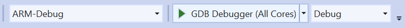

# Multi-Core app and OTA deployment lab
In this lab we'll look into building an end-to-end scenario with a high-level connectivity application (IoTConnectHL) 
running on the A7 core in the POSIX environment accompanied by one or two real-time capable applications 
running on the M4 cores ( (Color)SphereRT ); each of them communicating with the highlevel app via inter-core communications.

Then we'll setup the Azure Sphere Security Service to deploy different app combinations over the air and we will see how 
moving a device between Products and DeviceGroups affects what Deployments it will receive.

## Part 1: Multi-Core App Overview
First we take a look at the source tree and what it contains:
* **CMakeFiles**: contains a copy of the Azure Sphere CMake toolchain usually part of the SDK but with some amendments to build the rather complex setup.
* **[IoTConnectHL](./IoTConnectHL/README.MD)**: This folder contains the solution for the high-level POSIX connectivety application that connects to IoT Hub, 
communicates through inter-core communication with any of the real-time capable partner apps. Although the intercore communication
is based on the [IntercoreComms sample](https://github.com/Azure/azure-sphere-samples/tree/master/Samples/IntercoreComms) it extends the 
protocol handler so that it automatically adjusts to i.e. manually sideloaded real-time capable apps. Pressing ButtonA increments a blink index value 
and sends it to active real-time partner applications.
* **[RedSphereRT](./RedSphereRT/README.MD)**,  **[GreenSphereRT](./GreenSphereRT/README.MD)**, **[BlueSphereRT](BlueSphereRT/README.MD)**: 
These directories contain the projects for three very similar real-time capable applications for the M4 cores. 
You can deploy up to two of them at the same time on the MT3620. They receive changes to the blink index value from the high level connectivety app.
RedSphere blinks LED #1 in Red, GreenSphere blinks LED #2 in Green and BlueSphere blinks LED #3 in Blue to visually indicate each app running seperately.
* **[SharedRT](./Shared.RT/README.MD)**: This directory contains common source files for the real-time capable apps to initialize the 
GPIO blocks, timer IRQs and for inter-core communications.

### To build and run the multi-core sample

**Prep your device**
1. Ensure that your Azure Sphere device is connected to your PC, and your PC is connected to the internet.
1. Right-click the Azure Sphere Developer Command Prompt shortcut and select **More&gt;Run as administrator**.
1. At the administrative command prompt, prepare the connected device for RTCore-Debugging :
   ```sh
   azsphere device enable-development --enable-rt-core-debugging
   ```
   This command must be run as administrator when you enable real-time capable core debugging because it installs USB drivers for the debugger.
1. Close the window after the command completes because administrator privilege is no longer required.  
    **Note:** As a best practice, you should always use the lowest privilege that can accomplish a task.
1. Open an Azure Sphere Developer Command Prompt
1. Change your directory to the OTA-sample directory and keep the window open (we'll need it for later sideloading). 
    **Tip:** To easily get the path, Right-Click the root in the Solution Explorer window and click "Copy path" and paste it into the 
    Azure Sphere command shell after a CD command.

There are multiple ways to work with Visual Studio and multi-core applications. 
You can either open the individual project sub-directories and follow the instructions there, i.e. [IoTConnectHL: High-level connectivety application (POSIX)](IoTConnectHL/README.MD) to build and deploy the first
application and then open another instance of Visual Studion and follow the instructions in [RedSphereRT: real-time-capable application](RedSphereRT/README.MD) .

Or you can continue here and start off the main directory [Using Visual Studio](#using-visual-studio) or [Using Visual Studio Code](#using-visual-studio-code):

### Using Visual Studio

**Build all apps and deploy the high-level application**

1. Start a Visual Studio instance.
1. From the **File** menu, select **Open > Folder...** and navigate to the "OTA" folder.
1. From the **Build** menu select **Rebuild All**

You will see that once you open the OTA-directory in Visual Studio it will start traversing the directory structures 
and generates the CMake caches for IoTConnectHL, BlueSphereRT, GreenSphereRT and RedSphereRT. The Rebuild all will then compile 
each application and build the imagepackage files.

>**Note:** Don't forget to update your *IoTConnectHL/app_manifest.json* ! [IoTConnectHL](IoTConnectHL/README.MD) has the details where to find that data.

In your Visual Studio standard toolbar you should see the default build settings alike:



Click on dropdown arrow after "GDB Debugger (All Cores)" to reveal the list of available targets and select **IoTConnectHL (HLCore)**.
It should now show up as the new target like:


Now click the *IoTConnectHL (HLCore)* button itself to start the debugging session. Your output will likely look like
```
    Remote debugging from host 192.168.35.1, port 58702
    INFO: Azure IoT application starting.
    INFO: Opening MT3620_RDB_BUTTON_A.
    [Azure IoT] Using HSM cert at /run/daa/########-####-####-####-############
    [Azure IoT] IoTHubDeviceClient_CreateWithAzureSphereDeviceAuthProvisioning returned 'AZURE_SPHERE_PROV_RESULT_OK'.
    [Azure IoT] INFO: AzureIoT_DoPeriodicTasks calls in progress...
    INFO: IoT Hub Connection Status Changed to 1.
    [Azure IoT] INFO: connection to the IoT Hub has been established (IOTHUB_CLIENT_CONNECTION_OK).
    [Azure IoT] INFO: AzureIoT_DoPeriodicTasks calls in progress...
    [Azure IoT] INFO: AzureIoT_DoPeriodicTasks calls in progress...
```

**Build and deploy a real-time capable application**

1. Start a *new* Visual Studio instance.
1. From the **File** menu, select **Open > Folder...** and open the **RedSphereRT** folder.
1. In this new Visual Studio session the target app should already be **RedSphereRT (RTCore)**, so click it to run.

>**Note**
>To enable multiple debugging targets, each of the application directories needs its own *launch.vs.json* file:

<pre><code>{
  "type": "azurespheredbg",
  "name": "RedSphereRT (RTCore)",
  "project": "CMakeLists.txt",
  "inheritEnvironments": [
    "AzureSphere"
  ],
  "customLauncher": "AzureSphereLaunchOptions",
  "workingDirectory": "${workspaceRoot}",
  "applicationPath": "${debugInfo.target}",
  "imagePath": "${debugInfo.targetImage}",
  "targetCore": "<b>RTCore</b>",
  <b>"partnerComponents": [ 
    "33e04e8f-a020-4af8-80d0-8064343e0616", 
    "7E5FAB32-801C-4EDF-A1AA-9263652AA6BD", 
    "07562362-3FEC-46C8-B0AF-DB9507F32748" ]</b>
},</code></pre>

For each real-time capable application I've added a seperate *configurations* list entry with
* **name** giving it a unique name that is going to be listed in the **Select Startup Menu**
* **targetCore** for an app, this needs to be either *HLCore* or *RTCore*.
* **partnerComponents**: lists the ComponentId of the high-level connectivety app ( IoTConnectHL, GreenSphereRT and BlueSphereRT  ). 
This setting is required for the debugger to not remove the previously sideloaded high-level application 
(the one we have running in the other Visual Studio instance debugging session). 

>**Tip:** The default *launch.vs.json* in the OTA-directory has "targetCore": "<i>AnyCore</i>". 
>If you run the *GDB Debugger (All Cores)* configuration, VS will deploy all applications and allow debugging them side by side
>in one Visual Studio instance. However, in our sample setup we have 3 real-time apps but only 2 M-cores available. 
>VS would happily try to deploy all 4 apps together and fail at some point!

Now change back to the Visual Studio instance running IoTConnectHL. The debug output window should show it 
connecting to Azure IoT Hub and then show output alike
```
    [InterCore] Found F4E25978-6152-447B-A2A1-64577582F327.
    [InterCore] Sending: PING
    [Azure IoT Hub client] INFO: AzureIoT_DoPeriodicTasks calls in progress...
    [InterCore]: Received 'recv' from F4E25978-6152-447B-A2A1-64577582F327
```
indicating that IoTConnectHL has found the RedSphereRT real-time capable app (it shows its ComponentId). 
IoTConnectHL then repeatedly sends a *"PING"* message downstream which is kindly acknowledged by a *"recv"* message.
This pattern is very similar to a keep-alive message and if you look at the error handling sections in the code you'll see 
that I use it to check if the application is indeed still alive.

If you now press ButtonA, you should see the blink frequency changing and at the same time the output window will
show 
```
    [InterCore] Sending: BLNK.
    [Azure IoT] INFO: Set reported property 'LedBlinkRateProperty' to value 1.
    [InterCore]: Received 'recv' from F4E25978-6152-447B-A2A1-64577582F327
    [Azure IoT] INFO: Device Twin reported properties update result: HTTP status code 204
```
indicating that it had sent a *"Blink"* message and at the same time updated the Azure IoT Hub device twin *'LedBlinkRateProperty'* property.

**Congratulations**, you have now successfully deployed a highlevel application together with a real-time capable application
and they are happily working together. And you are now remotely debugging two applications at the same time.

If you now change to the Visual Studio instance running the RedSphereRT app, open the RedSphereRT/main.c and place a breakpoint 
at line #149.  It should immediately hit the breakpoint. Wait for a few seconds, remove the breakpoint and hit **Continue**.
Back in the Visual Studio instance running IoTConnectHL you should see the *"PING"* messages stacking up followed by a number of
*"recv"* messages indicating that RedSphereRT has emptied the mailslots once it was continued in the debugger. 

## Manual deployment using AZSPHERE.EXE
Let's now take a look at the Azure Sphere Command Window and enter
```
azsphere dev app show-status
```

It should show both apps deployed and indicate debugging the high-level app
```
    33e04e8f-a020-4af8-80d0-8064343e0616: App state   : debugging
    GDB port    : 2345
    Output port : 2342
    f4e25978-6152-447b-a2a1-64577582f327: App state: running
    Command completed successfully in 00:00:02.4453023.
```
Now manually deploy another application to get the second M4 core some work as well. 
```
azsphere dev sideload deploy -p .\GreenSphereRT\out\ARM-Debug\GreenSphereRT.imagepackage
azsphere dev app show-status
```
It should show all three applications running side by side and have LED1 blinking red and LED2 blinking green
```
    33e04e8f-a020-4af8-80d0-8064343e0616: App state   : debugging
    GDB port    : 2345
    Output port : 2342
    f4e25978-6152-447b-a2a1-64577582f327: App state: running
    7e5fab32-801c-4edf-a1aa-9263652aa6bd: App state: running
    Command completed successfully in 00:00:02.6309285.
```
At the same time the debug output of IoTConnectHL will now indicate that it found GreenSphereRT 
*(ComponentID: 7E5FAB32-801C-4EDF-A1AA-9263652AA6BD)* and started sending *"PING"*
messages to both real-time capable applications:
```
    [InterCore] Found 7E5FAB32-801C-4EDF-A1AA-9263652AA6BD.
    [Azure IoT Hub client] INFO: AzureIoT_DoPeriodicTasks calls in progress...
    [InterCore]: Received 'recv' from F4E25978-6152-447B-A2A1-64577582F327
    [InterCore] Sending: PING
    [InterCore] Sending: PING
    [Azure IoT Hub client] INFO: AzureIoT_DoPeriodicTasks calls in progress...
    [InterCore]: Received 'recv' from F4E25978-6152-447B-A2A1-64577582F327
    [InterCore]: Received 'recv' from 7E5FAB32-801C-4EDF-A1AA-9263652AA6BD
```

### Using Visual Studio Code

**Build all apps and deploy the high-level application**
1. Start a Visual Studio instance.
1. From the **File** menu, select **Open Workspace...** and open the *./OTA/MultiCoreApp.code-workspace*.
1. Open **View->Command Palette... (Ctrl-Shift-P)**  and enter "CMake: Clean Rebuild All Projects"
1. RightClick the blue status bar and make sure that "CMake Tools (Extension)" is active. Click on the -Icon and select "IoTConnectHL".<br>
It should now look like: 
1. Click on the Debug-Icon on the left NavBar (or press Ctrl-Shift-D) and select "Launch IoTConnectHL (gdb) (IoTConnectHL)" from the list.
1. Press F5 to start debugging

Once the Debug Console shows that it "Loaded 'target:/usr/lib/.... Symbols loaded." You can switch back to the "Output"

```
    Deploying image...
    Starting application...
    33e04e8f-a020-4af8-80d0-8064343e0616
    App state   : debugging
    GDB port    : 2345
    Output port : 2342
    Core        : High-level
    Azure Sphere SDK Directory: C:\Program Files (x86)\Microsoft Azure Sphere SDK\
    Azure Sphere SDK Directory: C:\Program Files (x86)\Microsoft Azure Sphere SDK\
    Starting debugger....

    Process /mnt/apps/33e04e8f-a020-4af8-80d0-8064343e0616/bin/app created; pid = 66
    Listening on port 2345

    Remote debugging from host 192.168.35.1, port 54990

    INFO: Azure IoT application starting.
    INFO: Opening MT3620_RDB_BUTTON_A.
    [Azure IoT] Using HSM cert at /run/daa/c0b88764-9273-46ab-bab2-effecf13f91c
    [Azure IoT] IoTHubDeviceClient_CreateWithAzureSphereDeviceAuthProvisioning returned 'AZURE_SPHERE_PROV_RESULT_OK'.
    [Azure IoT] INFO: AzureIoT_DoPeriodicTasks calls in progress...
    INFO: IoT Hub Connection Status Changed to 1.
    [Azure IoT] INFO: connection to the IoT Hub has been established (IOTHUB_CLIENT_CONNECTION_OK).
    [Azure IoT] INFO: AzureIoT_DoPeriodicTasks calls in progress...
    [Azure IoT] INFO: AzureIoT_DoPeriodicTasks calls in progress...
```

>**Note:** Visual Studio Code doesn't support to debug multiple apps in one instance so you need to open another 
>Visual Studio Code Instance to debug the RTCore app.


 ## Part2: OTA deployment

Now it's time to look at how to [deploy the apps over the air (OTA)](./AS3Scripts/README.MD).

---
[Back to root](../README.MD#lab-5-multi-core-app-and-ota-deployment-lab)

---

### Disclaimer

#### Sample code - No Warranties
THE SAMPLE CODE SOFTWARE IS PROVIDED "AS IS" AND WITHOUT WARRANTY.TO THE MAXIMUM EXTENT 
PERMITTED BY LAW, MICROSOFT DISCLAIMS ANY AND ALL OTHER WARRANTIES, WHETHER EXPRESS OR 
IMPLIED, INCLUDING, BUT NOT LIMITED TO, ANY IMPLIED WARRANTIES OF MERCHANTABILITY, 
NON - INFRINGEMENT, OR FITNESS FOR A PARTICULAR PURPOSE, WHETHER ARISING BY A COURSE 
OF DEALING, USAGE OR TRADE PRACTICE OR COURSE OF PERFORMANCE.
In no event shall Microsoft, its licensors, the authors or copyright holders be liable 
for any claim, damages or other liability, whether in an action of contract, tort or 
otherwise, arising from, out of or in connection with the software or the use thereof.

This code may contain errors and/or may not operate correctly. Microsoft undertakes no 
duty to correct any errors or update the software. Your use of this code is optional and 
subject to any license provided therewith or referenced therein, if any. Microsoft does 
not provide you with any license or other rights to any Microsoft product or service 
through the code provided to you.

