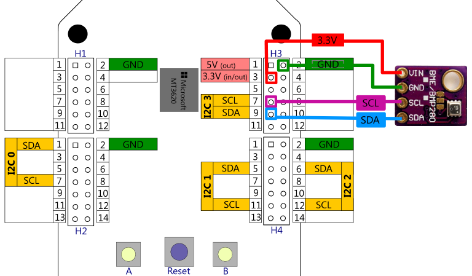
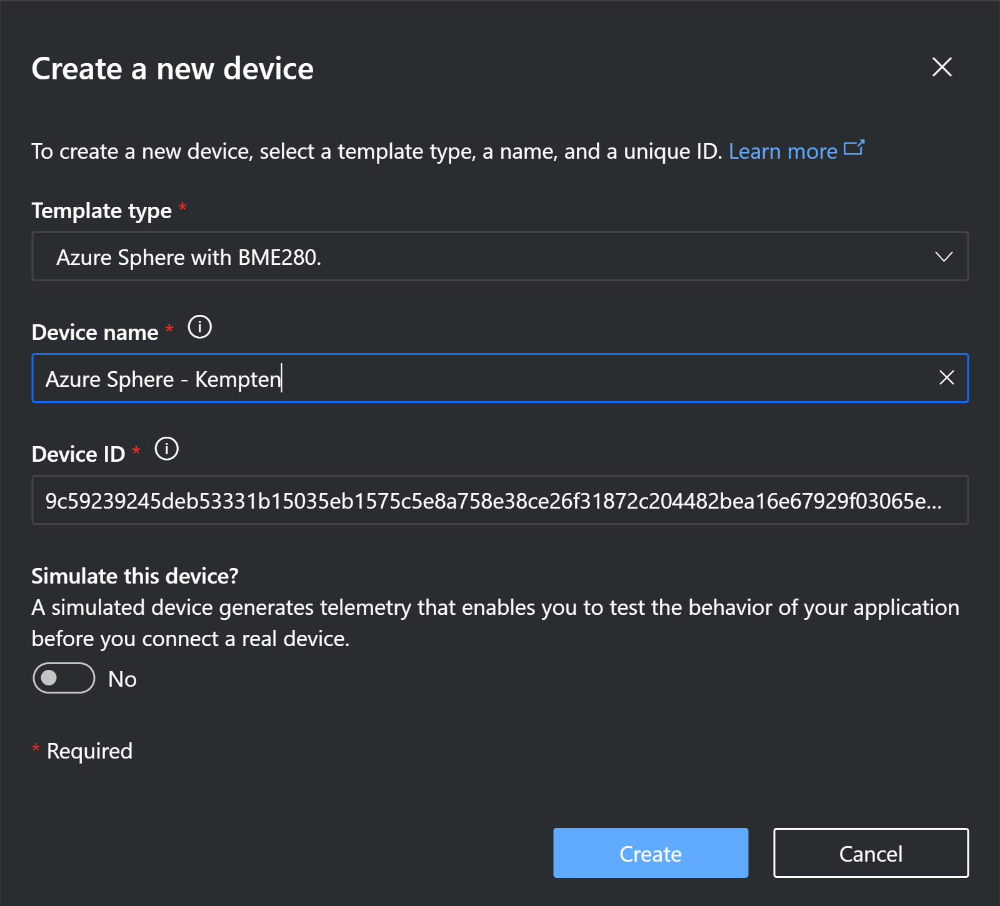

## Connecting an I2C sensor (Bosch BME280) and send telemetry to Azure IoT Central

In this example we will connect an I2C based sensor and send telemetry data to **Azure IoT Central**. In this example it is the 
Bosch BME280 temperature/humidity/pressure sensor.

The libBME280 project contains a wrapper library based on the original [Bosch driver](https://github.com/BoschSensortec/BME280_driver) for the 
Bosch BME280 temperature-, humidity- and pressure-sensor.

This sensor is e.g. available as [Seeed Groove BME280 sensor board](http://wiki.seeedstudio.com/Grove-Barometer_Sensor-BME280/) amongst other suppliers.

### Wiring the BME280 sensor

There are multiple sensor boards for the BME280 available (the Seeed Grove BME280 mentioned above looks slightly different but offers to use a Grove connector cable)
but essentially they all have the necessary power supply V(in) & GND and the I2C Pins *SDA* for data and *SCL* for clock called out on the printout.

| Purpose  | MT3620          |  BME280  | Pictured wire below |
|----------|-----------------|:--------:|:-------------------:|
|3.3 volts | Header 3, pin 3 | Vin/Vcc  | red                 |
|Ground    | Header 3, pin 2 | Gnd      | green               |
|Data      | Header 3, pin 7 | SCL      | purple              |
|Clock     | Header 3, pin 9 | SDA      | blue                |




## Seting up Azure IoT Central
If you want to get rolling within minutes, follow the steps to [Import IoT Central Application Template](#Import-IoT-Central-Application-Template) , if you want to setup your 
dashboard manually, follow the steps layed out in [Manual IoT Central setup](#Manual-IoT-Central-setup).

#### Import IoT Central Application Template
Just click here to [import Azure Sphere with BME 280 Template](https://apps.azureiotcentral.com/build/new/94a93fe6-cd6e-4518-8c91-a30375cd7d3b),
and then select the type of IoT Central application you like. There is a free version available that allows to test your application for 7 days.

Since IoT Central uses Azure IoT Hub and Azure IoT Hub Device Provisioning Service under the hood, you need to setup the certificate chain 
of your Azure Sphere Tenant with IoT Central application following the the steps starting with  
[Set up Azure IoT Central to work with Azure Sphere, Step #2](https://docs.microsoft.com/en-us/azure-sphere/app-development/setup-iot-central#step-2-download-the-tenant-authentication-ca-certificate
).

Now you can continue with [Create a device](#Create-a-device).

#### Manual IoT Central Setup
The Azure Sphere Documentation has an extensive description on how to get started under 
[Set up Azure IoT Central to work with Azure Sphere](https://docs.microsoft.com/en-us/azure-sphere/app-development/setup-iot-central
).

Apart from creating the IoT Central application itself, the remaining steps will look fairly familiar: 
Setting up the certificate chain for Azure IoT Hub DPS inside Azure IoT Central.

To setup the telemetry, commands and properties for this sample you can import an Azure IoT PnP device template from the provided json here: 
[*Azure Sphere with BME280 Lab.json*](./Azure%20Sphere%20with%20BME280%20Lab.json).

To do this, open your IoT Central application and under *App settings* go to *Device Templates* -> *+New* and under 
*Create a custom device template* select "IoT Device" and press [Next:Review], give it a name and hit [Create] .

On the device template page you can now *Import capabililty model* and import the [*Azure Sphere with BME280 Lab.json*](./Azure%20Sphere%20with%20BME280%20Lab.json) .

### Create a Device
You could just start this lab and fire up the SphereBME280 application. If you have everything setup correctly with IoT Central, it would autmatically 
connect and create a device therein. The only caveat with that is that the device name would be your Azure Sphere Device Id.

To have devices enlisted with a more human readable names you can do a pre-setup of the device entry. Navigate to
<svg width="16" height="16" fill="none"><path fill-rule="evenodd" clip-rule="evenodd" d="M4.409 9.223l-.694-.536 3.76-2.855.536.694L4.41 9.223z" fill="var(--color-main-nav-foreground-primary)"></path><path d="M4.593 8.687h-.878v5.658h.878V8.687z" fill="var(--color-main-nav-foreground-primary)"></path><path d="M8.768 6.939a1.511 1.511 0 100-3.023 1.511 1.511 0 000 3.023z" stroke="var(--color-main-nav-foreground-primary)" stroke-miterlimit="10"></path><path fill-rule="evenodd" clip-rule="evenodd" d="M15.158 6.613l.843.465-4.45 3.26-.677-.659 4.284-3.066z" fill="var(--color-main-nav-foreground-primary)"></path><path d="M9.847 12.799a1.511 1.511 0 100-3.023 1.511 1.511 0 000 3.023z" stroke="var(--color-main-nav-foreground-primary)" stroke-miterlimit="10"></path><path d="M15.5 8a7.5 7.5 0 11-15 0 7.5 7.5 0 0115 0z" stroke="var(--color-main-nav-foreground-primary)"></path></svg> 
*Devices* and press the *"+"* button to open the add device dialog and add your Azure Sphere device id **in lower case characters**. 
To get the device id in lower case, you can start Powershell in the Azure Sphere Developer Command Prompt and run
```powershell
 (azsphere dev show-attached)[0].Split(":")[1].Trim().ToLower()
```
or in a Bash shell
```bash
azsphere dev show-attached | tr '[:upper:]' '[:lower:]'
```


It should then look like:


### app_manifest.json settings
In contrast to Azure IoT Hub (being a *Platform as a Service*/PaaS), Azure IoT Central is a complete
*Software as a Service*/SaaS solution. However, it is obviously built using existing PaaS 
services such as Azure IoT Hub, Azure IoT Device Provisioning Service amongst others 
but hides the individual building blocks under the hood.

With Azure Sphere this raises a specific question: **Where do you get the actual IoT Hub DNS-name and the DPS Scope ID to add as 
capability settings in the *appmanifest.json* and provision the app_manifest.json ?**

Fortunately the Azure Sphere product group has a tool available that unveils all that information for you. Please check the 
[Azure IoT Sample github repo](https://github.com/Azure/azure-sphere-samples/tree/master/Samples/AzureIoT) .
In the [Tools directory](https://github.com/Azure/azure-sphere-samples/tree/master/Samples/AzureIoT/Tools) You will find a tool called
`ShowIoTCentralConfig.exe` that nicely extracts all that information from IoT Central similar to the following:

<DIV class="extended-markdown tip border rounded-1 mb-4 p-3 border-blue bg-blue-light f5">
<p><b>Tip:</b> This is a special tip markdown</p>
</DIV>


<DIV class="extended-markdown warning border rounded-1 mb-4 p-3 border-red bg-red-light f5">
<p><b>Tip:</b> This is a special tip markdown</p>
</DIV>

<pre><code>
C:\&gt;<b>ShowIoTCentralConfig.exe</b>
Tool to show Azure IoT Central configuration for Azure Sphere applications
Are you using a legacy (2018) IoT Central application (Y/N)
> <b>N</b>
Enter the IoT Central App URL (e.g. https://myapp.azureiotcentral.com)
> <b class="cmd">https://**YOUR_IOTCENTRAL_APP**.azureiotcentral.com/</b>
You need to generate an Azure IoT Central application API Token (Adminstration | API tokens), this requires Application administrator rights
Enter your Azure IoT Central application API Token
> <b class="cmd">**Your API token from Administration -> API tokens ***</b>
Enter the ID Scope from the IoT Central App (Administration | Device connection)
> <b class="cmd">**Your DPS scope ID from Administration -> Device Connection ***</b><br />
Find and modify the CmdArgs, AllowedConnections and DeviceAuthentication lines in your app_manifest.json so each includes the 
content from the below:
<b>"CmdArgs": [ "--ConnectionType DPS", "--ScopeID 0ne000A5318" ],
"Capabilities": {
    "AllowedConnections": [ "global.azure-devices-provisioning.net",
    "<b>iotc-d51104e7-3071-4dbe-b068-48fbd28598ad.azure-devices.net</b>"],
    "DeviceAuthentication": "--- YOUR AZURE SPHERE TENANT ID---",
}</b>

Obtain your Azure Sphere Tenant ID by opening an Azure Sphere Developer Command Prompt/Terminal and typing the following command:
'azsphere tenant show-selected'<br /></code></pre>

>**Important:** My samples are using a slightly different command line syntax, so just copy it in the form
<pre><code>"CmdArgs": [ <b>"0ne000A5318"</b> ],</code></pre>


## Reviewing the code


To stretch your brain a bit, look at the source code of [*main.c*](./main.c) to see what telemetry
it implements, what events, and what properties it supports (pls. note the different
format of the Device Twin desired property). A couple hints:

Looking at [*main.c* Line 347](./main.c#L347) you can likely deduct the schema for the telemetry data looking like: 
```json
{
 "temperature" : 36.34,
 "pressure" : 1096.35,
 "humidity" : 45.25
}
```

and looking around the `ButtonPollTimerHandler()` [*main.c* Line 625](./main.c#L625)
you see how we raise events with Azure IoT Central: you need to send a device-to-cloud message with 
the event-name as property-name and provide some arbitrary value; i.e. to raise 
the `buttonA`-event the json needs to look like: 
```json
{ "buttonA" : "pressed" }
```
and to raise the `buttonB`-event, the json would be
```json
{ "buttonB" : "pressed" }
```

Azure IoT Central also supports properties, that are actually based on Azure IoT Hub Device Twin. 

>**Note:** Azure IoT Central implements Azure IoT Plug&Play and for some time had the schema changed to *blinkRateProperty.value* alike:
>```json
>{
>   "blinkRateProperty" : {	
>     "value" : 1
>   }
>}
>```
>and required the property to be mirrored as reported property with additional metadata.
>
>As of end of July 2020 the schema was reverted back to use the shortform notation  `{ "propertyname" : 1, "$version" : 7 }` . 
>See [IoT Central Properties](https://docs.microsoft.com/en-us/azure/iot-central/core/concepts-telemetry-properties-commands#properties) for more
>info on the schema for *reported properties*.
>
>For a *desired property*, you need to indicate the successful receipt to Azure Iot Central in the form of of a telemetry message:
>```json
>{ 
>  "blinkRateProperty" : {
>      "value": 1,
>      "ac": 200,
>      "ad": "completed",
>      "av": 7
>    }
>}
>```
>See [Azure IoT Central: Writeable property types](https://docs.microsoft.com/en-us/azure/iot-central/core/concepts-telemetry-properties-commands#writeable-property-types) 


Now it's time to get cracking:

Step 1. Create a new Azure IoT Central application

Step 2. Configure the Azure Sphere certificate chain in Azure IoT Central

Step 3. Create a new device

Step 4. Run the  [`ShowIoTCentralConfig.exe`](https://github.com/Azure/azure-sphere-samples/tree/master/Samples/AzureIoT/Tools) 
and copy&paste the settings into your *app_manifest.json*

Step 5. Run the application and see telemetry visualized in the dashboard.


---
[Back to root](../README.MD#connecting-an-i2c-sensor-bosch-bme280-and-send-telemetry-to-azure-iot-central)

---

### Disclaimer

#### Sample code - No Warranties
THE SAMPLE CODE SOFTWARE IS PROVIDED "AS IS" AND WITHOUT WARRANTY.TO THE MAXIMUM EXTENT 
PERMITTED BY LAW, MICROSOFT DISCLAIMS ANY AND ALL OTHER WARRANTIES, WHETHER EXPRESS OR 
IMPLIED, INCLUDING, BUT NOT LIMITED TO, ANY IMPLIED WARRANTIES OF MERCHANTABILITY, 
NON - INFRINGEMENT, OR FITNESS FOR A PARTICULAR PURPOSE, WHETHER ARISING BY A COURSE 
OF DEALING, USAGE OR TRADE PRACTICE OR COURSE OF PERFORMANCE.
In no event shall Microsoft, its licensors, the authors or copyright holders be liable 
for any claim, damages or other liability, whether in an action of contract, tort or 
otherwise, arising from, out of or in connection with the software or the use thereof.

This code may contain errors and/or may not operate correctly. Microsoft undertakes no 
duty to correct any errors or update the software. Your use of this code is optional and 
subject to any license provided therewith or referenced therein, if any. Microsoft does 
not provide you with any license or other rights to any Microsoft product or service 
through the code provided to you.
