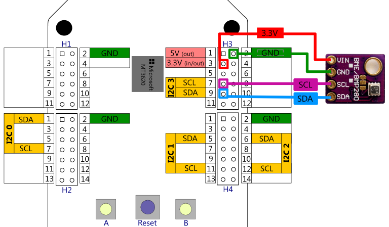
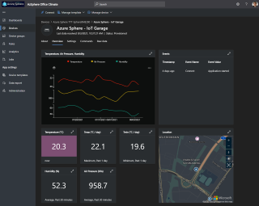

## E2E "Office Climate IoT Solution" with industry grade I2C sensor, Azure IoT PnP  and Azure IoT Central
In this example we will connect an industrial grade I2C based sensor and send telemetry data using **Azure IoT Plug-and-Play** 
to an **Azure IoT Central** application. 

In this example it is the  Bosch BME280 temperature/humidity/pressure sensor (or BMP280 with temperature/pressure accordingly). For this sensor, 
Bosch Sensortec provides a platform independent libraries on GitHub ([BME280_driver](https://github.com/BoschSensortec/BME280_driver) 
or [BMP2-Sensor-API](https://github.com/BoschSensortec/BMP2-Sensor-API/) respectively.
The sensor itself offers I2C as well as SPI connectivety options and depending on your module it may offer either or both of them.
As all modules I have at hand offer I2C and this has some cost saving advantages over SPI (i.e. less wiring, multiple sensors on I2C bus) this examples is using I2C.

The BMP280 sensor is e.g. available as [Seeed Groove BME280 sensor board](http://wiki.seeedstudio.com/Grove-Barometer_Sensor-BME280/) 
amongst many other suppliers.

>**New:** With the 21.10 release I've updated the sample to fully implement **Azure IoT Plug-and-Play** data models,
>with a publicly available model id and updated the **Azure IoT Central** application template accordingly. 
>Since I accidentally picked the BM**P**280 instead of the BM**E**280 for one of the bootcamps I had the sample adapted to work with either of the two sensors.


### Wiring the I2C sensor

There are multiple sensor boards for the BME280 available (the Seeed Grove BME280 mentioned above looks slightly different but offers to use a Grove connector cable)
but essentially they all have the necessary power supply V(in) & GND and the I2C Pins *SDA* for data and *SCL* for clock called out on the printout.

| Purpose  | MT3620          |  BME280  | Pictured wire below |
|----------|-----------------|:--------:|:-------------------:|
|3.3 volts | Header 3, pin 3 | Vin/Vcc  | red                 |
|Ground    | Header 3, pin 2 | Gnd      | green               |
|Data      | Header 3, pin 7 | SCL      | purple              |
|Clock     | Header 3, pin 9 | SDA      | blue                |



>**Note:**
>In case you want to use a Bosch BM**P**280 instead of the BM**E**280, the wiring is identical, you just need to change the
>`SENSOR_TYPE` variable in [*CMakeLists.txt* afterLine 8](./CMakeLists.txt#L7).


## Seting up Azure IoT Central
If you want to get rolling within minutes, follow the steps to [Import IoT Central Application Template](#Import-IoT-Central-Application-Template) , if you want to setup your 
dashboard manually, follow the steps layed out in [Manual IoT Central setup](#Manual-IoT-Central-setup).

#### Import IoT Central Application Template
Just click here to [import Azure Sphere with BME 280 Template (IoT PnP enabled)](https://apps.azureiotcentral.com/build/new/bc82e494-2521-40e4-8bca-593aea4ccdb2),
and then select the type of IoT Central application you like. There is a free version available that allows to test your application for 7 days.

Since IoT Central uses Azure IoT Hub and Azure IoT Hub Device Provisioning Service under the hood, you need to setup the certificate chain 
of your Azure Sphere Tenant with IoT Central application following the the steps starting with  
[Set up Azure IoT Central to work with Azure Sphere, Step #2](https://docs.microsoft.com/en-us/azure-sphere/app-development/setup-iot-central#step-2-download-the-tenant-authentication-ca-certificate
).

Now you can continue with [Create a device](#Create-a-device).

#### Manual IoT Central Setup
The Azure Sphere Documentation has an extensive description on how to get started under 
[Set up Azure IoT Central to work with Azure Sphere](https://docs.microsoft.com/en-us/azure-sphere/app-development/setup-iot-central
).

Apart from creating the IoT Central application itself, the remaining steps will look fairly familiar: 
Setting up the certificate chain for Azure IoT Hub DPS inside Azure IoT Central.

>**Note** : With the PnP schema publicly available on [GitHub : Azure/iot-plugandplay-models](https://github.com/Azure/iot-plugandplay-models/tree/main/dtmi/azsphere/spherettt)
> there is no need anymore to manually import the DTDL into Azure IoT Central.

### Create a Device
You could just start this lab and fire up the SphereBME280 application. If you have everything setup correctly with IoT Central, it would autmatically 
connect and create a device therein. The only caveat with that is that the device name would be your Azure Sphere Device Id and you have to manually assign it the device template.

You can rename the device afterwards though: open the device dashboard (Devices -> click the id under "Device name"). Above the device path you should see an
[Manage device v] menu and therein "Rename".

To have devices enlisted with a more human readable names upfront you can do a pre-setup of the device entry. Navigate to  
*Devices* and press the *"+"* button to open the add device dialog and add your Azure Sphere device id **in lower case characters**. 
To get the device id in lower case, you can start Powershell in the Azure Sphere Developer Command Prompt and run
```powershell
 (azsphere device show-attached)[0].Split(":")[1].Trim().ToLower()
```
or in a Bash shell
```bash
azsphere device show-attached | tr '[:upper:]' '[:lower:]'
```


It should then look like:


### app_manifest.json settings
In contrast to Azure IoT Hub (being a *Platform as a Service*/PaaS), Azure IoT Central is a complete
*Software as a Service*/SaaS solution. However, it is obviously built using existing PaaS 
services such as Azure IoT Hub, Azure IoT Device Provisioning Service amongst others 
but hides the individual building blocks under the hood.

With Azure Sphere this raises a specific question: **Where do you get the actual IoT Hub DNS-name and the DPS Scope ID to add as 
capability settings in the *appmanifest.json* and provision the app_manifest.json ?**

Fortunately the Azure Sphere product group has a tool available that unveils all that information for you. Please check the 
[Azure IoT Sample github repo](https://github.com/Azure/azure-sphere-samples/tree/master/Samples/AzureIoT) .
In the [Tools directory](https://github.com/Azure/azure-sphere-samples/tree/master/Samples/AzureIoT/Tools) You will find a tool called
`ShowIoTCentralConfig.exe` that nicely extracts all that information from IoT Central similar to the following:


<pre><code>
C:\&gt;<b>ShowIoTCentralConfig.exe</b>
Tool to show Azure IoT Central configuration for Azure Sphere applications
Are you using a legacy (2018) IoT Central application (Y/N)
> <b>N</b>
Enter the IoT Central App URL (e.g. https://myapp.azureiotcentral.com)
> <b color="red">https://**YOUR_IOTCENTRAL_APP**.azureiotcentral.com/</b>
You need to generate an Azure IoT Central application API Token (Adminstration | API tokens), this requires Application administrator rights
Enter your Azure IoT Central application API Token
> <b>**Your API token from Administration -> API tokens ***</b>
Enter the ID Scope from the IoT Central App (Administration | Device connection)
> <b>**Your DPS scope ID from Administration -> Device Connection ***</b><br />
Find and modify the CmdArgs, AllowedConnections and DeviceAuthentication lines in your app_manifest.json so each includes the 
content from the below:
<b>"CmdArgs": [ "--ScopeID", <b>"0ne000A5318"</b> ],
"Capabilities": {
    "AllowedConnections": [ "global.azure-devices-provisioning.net",
    "<b>iotc-d51104e7-3071-4dbe-b068-48fbd28598ad.azure-devices.net</b>"],
    "DeviceAuthentication": "--- YOUR AZURE SPHERE TENANT ID---",
}</b>

Obtain your Azure Sphere Tenant ID by opening an Azure Sphere Developer Command Prompt/Terminal and typing the following command:
'azsphere tenant show-selected'<br /></code></pre>

## Reviewing the code

>**Note:** With version 21.10 and the addition of **Azure IoT PnP** I have refactored the *azure_iot_utilities.c* library 
>since it had organically grown over the months to cover different use cases: 
>
>They are now separated into *azure_iot.c* containing the core low level wrapper functions for the Azure IoT Hub using the standard Azure IoT Hub C SDK,
>*azure_iot_dps.c* implements a *non-blocking* variant for device provisioning using the level Azure IoT Hub Device Provisioning Service api's.
>*azure_iot_json.c* mirrors (in lieu of C++ overloading capability) the data-bound APIs using json-objects (using the *parson.c* library) and 
>*azure_iot_pnp.c* adds Azure IoT PnP specific helper function implementations. 

To stretch your brain a bit, look at the source code of [*main.c*](./main.c) to see what telemetry
it implements, what (Azure IoT Central) events, and what properties it supports (pls. note the different
format of the Device Twin desired property). A couple hints:

Looking at `SendTelemetryMessage()` [*main.c* Line 414](./main.c#L414) you can likely deduct the schema for the BMP280 sensor telemetry data looking like: 
```json
{
 "temperature" : 36.34,
 "pressure" : 1096.35,
 "humidity" : 45.25
}
```

Looking around the `SendEventMessage()` [*main.c* Line 387](./main.c#L387)
you see how we raise events with Azure IoT Central: you need to send a device-to-cloud message with 
the event-name as property-name and provide some arbitrary value; i.e. to raise 
the `buttonA`-event the json needs to look like: 
```json
{ "buttonA" : "pressed" }
```
and to raise the `buttonB`-event, the json would be
```json
{ "buttonB" : "pressed" }
```

You'll also note that both introduce `AzureIoT`**`PnP`**`_SendJsonMessage()` using Azure IoT PnP component names accordingly. 


### Azure IoT PnP Telemetry

Azure IoT PnP uses the [*Digital Twins Definition Language (DTDL v2)*](https://github.com/Azure/opendigitaltwins-dtdl/blob/master/DTDL/v2/dtdlv2.md)
to define the data schema used by the application.

The application at the beginning reported its Azure PnP model id  as `"dtmi:azsphere:SphereTTT:SphereBME280;1"`
(if you chose to use the BM**P**280 sensor instead it's `"dtmi:azsphere:SphereTTT:SphereBMP280;1"`) to DPS and IoT Hub respectively.
The Azure IoT PnP schema for *SphereBME280* you can find in the [*iot-plugandplay-models* repository](https://github.com/Azure/iot-plugandplay-models) as 
[*spherebme280-1.json**](https://github.com/Azure/iot-plugandplay-models/blob/main/dtmi/azsphere/spherettt/spherebme280-1.json)) 


It uses *Components* to structure the data into functional parts; for the BME280 sensor it contains the "bme280" component
referring to jet another schema definition for it.
```json 
{
    "@type": "Component",
    ...
    "name": "bme280",
    "schema": "dtmi:azsphere:SphereTTT:BME280;1"
},
```
Per [PnP naming conventions](https://github.com/Azure/iot-plugandplay-models/blob/main/pr-reqs.md#model-file-names) 
the public schema definition for the BME280 sensor: `"dtmi:azsphere:SphereTTT:BME280;1"` is defined in *[Azure/iot-plugandplay-models/**dtmi**/**azsphere**/**spherettt**/**bme280**-**1**.json](https://github.com/Azure/iot-plugandplay-models/blob/main/dtmi/azsphere/spherettt/bme280-1.json)*.

If you like to create your own schema definition, just follow the steps described in [Azure IoT PnP : **Submit a model**](https://github.com/Azure/iot-plugandplay-models/#submit-a-model), **fork** the [*public GitHub repo **Azure/iot-plugandplay-models** *](https://github.com/Azure/iot-plugandplay-models) and start adding your own path and json definitions, like I did with my fork on  
[*JuergenSchwertl/iot-plugandplay-models*](https://github.com/JuergenSchwertl/iot-plugandplay-models/).


With the device telemetry just containing the *temperature*, *humidity* (and *pressure* in case of BM**E**280) where does the component name go ?

It's attached to the message as a message property, named `"$.sub"` with the component name as value 
using [*azure_iot_pnp.c* : `IoTHubMessage_SetProperty(hIoTHubMessage, "$.sub", cstrPnPComponent);`](./azure_iot_pnp.c#L58).

### Azure IoT PnP (writable) Properties

Based on IoT Hub, Azure IoT Central also supports properties based on Azure IoT Hub Device Twin. Azure IoT PnP also has a schema for this.  

>**Note:** Azure IoT Central implemented Azure IoT Plug&Play v1 beforehand and for some time had the schema changed 
>to json-objects for properties alike: `{ "blinkRateProperty" : { "value" : 1 } }`
>and required the property to be mirrored as reported property with additional metadata.
>
>Over the course of time the schema was reverted back to use the shortform notation  `{ "propertyname" : 1, "$version" : 7 }` 
>but for a *desired property*, you needed to indicate the successful receipt to Azure Iot Central in the form of of 
>an acknowledgement *message*: `{ "blinkRateProperty" : { "value": 1, "ac": 200, "av": 7, *"ad": "completed"* } }`.
>
>With the move to DTDL v2 mid July 2020 this has now changed again using a mirrored *reported property* in object notation with acknowledgement metadata.
>See [Azure IoT Central: Writeable property types](https://docs.microsoft.com/en-us/azure/iot-central/core/concepts-telemetry-properties-commands#writable-property-types) 

Our `"blinkRateProperty"` is part of the [`RGBLed`-Component in *rgbled-1.json*](https://github.com/Azure/iot-plugandplay-models/blob/main/dtmi/azsphere/spherettt/rgbled-1.json#L90)
and being a writable property it still needs to confirm receipt of the property change.
We'll get the DeviceTwinUpdate with a desiredProperties-json like
```json
{
  "rgbLed" : {	
    "blinkRateProperty" : 2,
    "__t" : "c"
  },
  "$version" : 3
}
```
where `"__t"` is a marker, indicating that `"rgbLed"` is a PnP component. Azure IoT Hub device twin adds the versioning system property `"$version"`.
[*main.c* : `DeviceTwinUpdate()`](./main.c#L491) extracts the property value and device twin version to report it back.


[*azure_iot_central.c* : `AzureIoTCentral_AckComponentPropertyChange()`](./azure_iot_central.c#L206) creates the needed *acknowledgement reported property* response:
```json
{ 
  "rgbLed" : {                # component name
    "blinkRateProperty" : {   # property name
      "value" : 2,            # property value
      "av" : 1,               # property version
      "ac" : 200,             # status
      "ad" : "complete"       # optional
    },
    "__t" : "c"               # component marker
  } 
}
```


Now it's time to get cracking:

1. Create a new Azure IoT Central application

2. Configure the certificate chain of your Azure Sphere tenant in Azure IoT Central

3. Create a new device

4. Run the  [`ShowIoTCentralConfig.exe`](https://github.com/Azure/azure-sphere-samples/tree/master/Samples/AzureIoT/Tools) 
and copy&paste the settings into your *app_manifest.json*

5. Run the application and see telemetry visualized in the dashboard (click to enlarge image).

[](./Images/iotc-device-overview-lg.png)


---
[Back to root](../README.MD#connecting-an-i2c-sensor-bosch-bme280-and-send-telemetry-to-azure-iot-central)

---

### Disclaimer

#### Sample code - No Warranties
THE SAMPLE CODE SOFTWARE IS PROVIDED "AS IS" AND WITHOUT WARRANTY.TO THE MAXIMUM EXTENT 
PERMITTED BY LAW, MICROSOFT DISCLAIMS ANY AND ALL OTHER WARRANTIES, WHETHER EXPRESS OR 
IMPLIED, INCLUDING, BUT NOT LIMITED TO, ANY IMPLIED WARRANTIES OF MERCHANTABILITY, 
NON - INFRINGEMENT, OR FITNESS FOR A PARTICULAR PURPOSE, WHETHER ARISING BY A COURSE 
OF DEALING, USAGE OR TRADE PRACTICE OR COURSE OF PERFORMANCE.
In no event shall Microsoft, its licensors, the authors or copyright holders be liable 
for any claim, damages or other liability, whether in an action of contract, tort or 
otherwise, arising from, out of or in connection with the software or the use thereof.

This code may contain errors and/or may not operate correctly. Microsoft undertakes no 
duty to correct any errors or update the software. Your use of this code is optional and 
subject to any license provided therewith or referenced therein, if any. Microsoft does 
not provide you with any license or other rights to any Microsoft product or service 
through the code provided to you.
